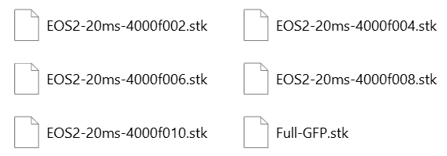
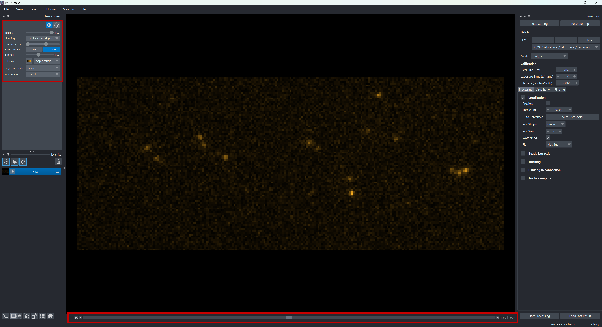
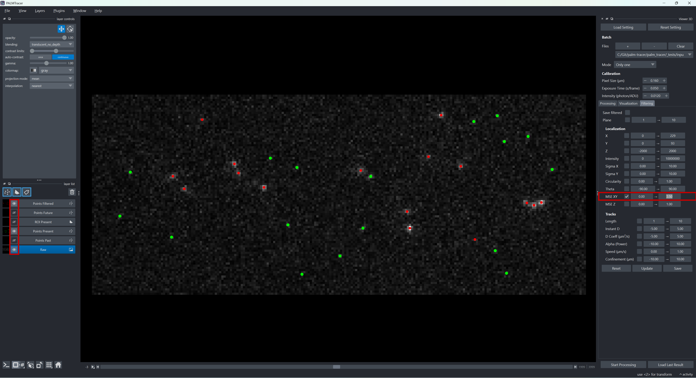
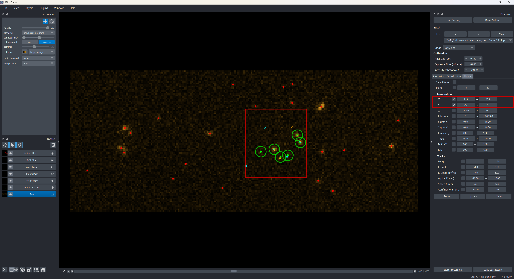
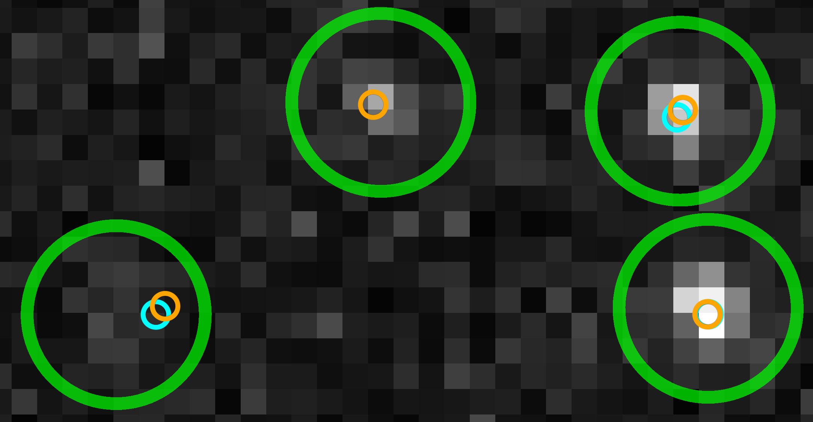
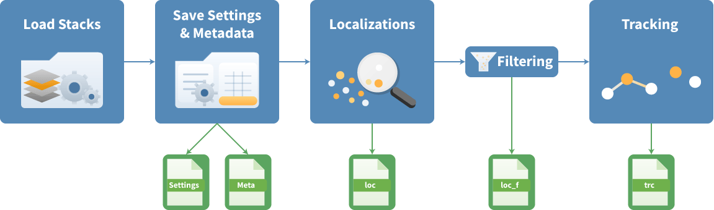

Cas 1 : Single Particle Tracking (SPT)
===================================================

Contexte : Le Suivi de particules individuelles (SPT) permet de suivre le mouvement de particules individuelles dans des échantillons biologiques.
Cette technique est largement utilisée pour étudier la dynamique des protéines, des organites et d'autres structures cellulaires.
Dans ce cas d'utilisation, nous allons explorer comment utiliser Napari et PALMTracer pour analyser des données de SPT.

Ouvrir Napari et PALMTracer
---------------------------------------------------

Suivez les instructions d'installation pour PALMTracer, puis lancez-le (plus d'informations :ref:`ici <install_page>`).
Assurez-vous que vous avez les données de SPT prêtes à être analysées.

.. note:: La méthode d'accès aux données peut être une source de ralentissement.
	Si vous accédez à vos données via un réseau, il est recommandé de les copier localement pour accélérer le traitement.
	De plus, si vous avez des données volumineuses, assurez-vous d'avoir suffisamment de mémoire RAM pour les traiter efficacement.
	Un fichier de 20Go nécessite au moins 32Go de RAM. En dessous de cette limite, d'importants ralentissements pourront être présents.

Ouvrir le(s) fichier(s) de données
---------------------------------------------------

Dans notre exemple, nous avons des données de SPT sous forme de fichiers :file:`STK` de Metamorph
(ce sont simplement des fichiers :file:`TIFF`, mais Metamorph insère sa propre extension).
Nous avons 5 fichiers qui constituent une seule pile de 5*4000 frames ainsi qu'une image de base en GFP pour la visualisation.

Pour tester le traitement et les paramètres, nous n'allons charger qu'un seul fichier pour le moment.
Vous pouvez cliquer sur le bouton :guilabel:`+` dans la section Batch du plugin PALMTracer, allez chercher votre fichier pour l'ajouter.

.. note:: Pour charger les 4 fichiers, vous devez les ajouter un par un.

.. figure:: ../../_static/img/manual/Batch.png
   :figclass: centered-caption
   :alt: Paramètres de Batch.
   :align: center
   :width: 25%
   :target: ../../_static/img/manual/Batch.png

Une fois le fichier chargé, vous avez une prévisualisation de votre pile (par défaut positionné au plan central de la pile).
Vous pouvez modifier le contraste et la colormap pour bien visualiser les données.
Vous pouvez parcourir les plans avec les flèches gauche et droite du clavier ou directement sur le bas de la partie visualisation de Napari.

Localisation
------------

Prévisualisation
^^^^^^^^^^^^^^^^^^^

La première étape consiste à trouver les paramètres de localisation optimaux pour vos données.
Il suffit de cliquer sur localisation pour activer cette étape de traitement, puis de cliquer sur le bouton :guilabel:`Preview`
pour voir les points détectés en temps réel sur votre image.

Le bouton :guilabel:`Auto Threshold` permet de trouver un seuil de détection automatique, mais il est souvent nécessaire de le modifier.

On est en recherche d'un suivi, donc on va régler ce seuil pour être un peu plus permissif et éviter trop de coupures de trajectoires au prix de faux positifs.

.. list-table::
   :align: center
   :widths: 50 50
   :class: image-grid

   * - .. figure:: ../../_static/img/examples/spt/Preview_130.png
          :figclass: centered-caption
          :alt: Seuil automatique calculé à 130.86
          :width: 95%
          :target: ../../_static/img/examples/spt/Preview_130.png

          Seuil automatique calculé à 130.86

     - .. figure:: ../../_static/img/examples/spt/Preview_60.png
          :figclass: centered-caption
          :alt: Seuil défini à 60
          :width: 95%
          :target: ../../_static/img/examples/spt/Preview_60.png

          Seuil défini à 60

Vous pouvez voir un code couleur pour les points détectés :

- Les points verts sont ceux qui ont été détectés dans le plan actuel.
- Les points bleus sont ceux qui ont été détectés dans le plan précédent.
- Les points oranges sont ceux qui ont été détectés dans le plan suivant.
- Les points rouges sont ceux qui ont été détectés dans le plan actuel, mais qui ont été filtrés par les filtres de localisation.
- Un cercle vert apparait autour des points détectés dans le plan actuel, il permet de montrer la zone d'ajustement.
  Dans cet exemple, une zone de 7x7 signifie un cercle de 3 pixels de rayon autour du point détecté pour faire le fit gaussien ensuite.

Dans les paramètres de localisation, vous avez le watershed qui est une méthode de séparation de points très proches.
Il est quasiment toujours activé pour éviter d'avoir des points fusionnés.

La méthode d'ajustement permet d'affiner la détection initiale sur X et Y, mais également pour l'ajustement gaussien de définir la forme de la PSF
avec Sigma X (largeur horizontale), Sigma Y (largeur verticale) et Theta (orientation).
Selon le mode d'ajustement gaussien, vous avez les paramètres qui seront ajustés (:guilabel:`X, Y` signifie que seule la position sera ajustée,
alors que :guilabel:`X, Y, SigmaX, SigmaY, Theta` signifie que la position, la forme et l'orientation de la PSF seront ajustées, plus d'informations :ref:`ici <fit_page>`).

La taille de la zone d'intérêt (ROI) est importante, car elle doit être assez grande pour englober la PSF,
mais pas trop pour ne pas inclure d'autres localisations ou trop de fond. Ici, on choisit 7x7 pixels.

Filtres
^^^^^^^^^^^^^^

On peut déjà commencer à essayer les filtres de localisation pour voir leur effet sur les points détectés, par exemple le filtre de MSE XY qui permet de filtrer
les points en fonction de la qualité de l'ajustement gaussien.
Les points actuels qui ont été supprimés sont maintenant affichés en rouge, cela permet de voir l'effet du filtre sur les points détectés.

Il est possible de désactiver les différents calques dans la visualisation et chaque code couleur correspond à un calque différent.
Donc si vous avez trop d'informations, vous pouvez, par exemple, ne conserver que les points du plan actuel et les points filtrés durant cette étape.

Zones d'Intérêt (ROI)
^^^^^^^^^^^^^^^^^^^^^^^^^^

Pour le moment, il est possible de définir une Zone d'intérêt à partir des positions X et Y dans la section filtre. Les zones d'intérêts dessinées à la main seront présentes dans une mise à jour ultérieure.

Activation du Suivi et de la reconnexion
---------------------------------------------------

La longueur peut être réglée grâce à la prévisualisation de la localisation,
il faut trouver un compromis entre ne pas couper les trajectoires et ne pas faire de fausses connexions.

.. note:: Si vous considérez une distance maximale entre 2 plans de N Pixels, vous pouvez régler la taille de la zone d'intérêt à 2*N+1 pixels.
	Vous pourrez ainsi avoir un aperçu des éléments qui seront connectés en direct lors de la prévisualisation.

Dans l'exemple ci-dessous, la distance maximale est de 3 pixels, donc la zone d'intérêt est de 7x7 pixels.
On n'a conservé que les calques des points précédents, suivants ainsi que la zone d'intérêt du point actuel pour mieux visualiser les connexions qui seront faites.
On peut voir 4 détections sur le plan actuel, mais celui en haut à gauche ne possède pas de points précédents (en bleu) dans la zone de connexion, il ne sera donc pas connecté à une trajectoire présente dans le plan précédent.
Les 3 autres points seront connectés aux deux plans connexes, car ils ont un point précédent et un point suivant dans la zone de connexion.

Premier lancement du traitement
---------------------------------------------------

Dans le terminal qui a lancé Napari, vous pouvez voir le log du traitement qui s'affiche en temps réel.
Chaque ligne correspond à une étape du traitement, il est important de les comprendre pour savoir ce qui a été fait et identifier d'éventuels problèmes.

.. code-block:: console

   [02-06-2026 11:57:26] Log opened : C:\Git\sptPALM\EOS2-20ms-4000f002_PALM_Tracer\log-20260602_115726.log
   [02-06-2026 11:57:26] Start Processing.
   [02-06-2026 11:57:26] Output folder: C:\Git\\sptPALM\EOS2-20ms-4000f002_PALM_Tracer
   [02-06-2026 11:57:26] Meta file saved.
   [02-06-2026 11:57:26] Settings saved.
   [02-06-2026 11:57:26] Localization enabled.
   [02-06-2026 11:57:28] 	Saving the localization file (115533 localization(s) found).
   [02-06-2026 11:57:29] 		Filtering of file 16582 row(s) instead of 115533: 98951 deletion(s).
   [02-06-2026 11:57:29] Beads Extraction disabled.
   [02-06-2026 11:57:29] Tracking enabled.
   [02-06-2026 11:57:29] 	Saving the tracking file (16582 point(s) found).
   [02-06-2026 11:57:29] Blinking Reconnection disabled.
   [02-06-2026 11:57:29] Tracks Compute disabled.
   [02-06-2026 11:57:29] Gallery generation disabled.
   [02-06-2026 11:57:29] Graphical visualization disabled.
   [02-06-2026 11:57:29] High-resolution visualization disabled.
   [02-06-2026 11:57:29] Processing complete.
   [02-06-2026 11:57:29] Log closed : C:\Git\palm-tracer\palm_tracer\_tests\input\big input\sptPALM\EOS2-20ms-4000f002_PALM_Tracer\log-20260602_115726.log

Tout d'abord, on voit que le log a été ouvert et que le traitement a commencé, le dossier de sortie est indiqué ainsi que la sauvegarde des paramètres et des métadonnées.
On peut voir que le fichier de log possède un timestamp dans son nom, cela permet de différencier les différents traitements et de retrouver facilement le log correspondant à un traitement particulier.
Ce fichier de log est une copie de toutes les lignes avec entre crochets la date et l'heure qui s'affichent. Si des lignes ne possèdent pas de timestamp, celles-ci sont indépendantes du log et peuvent être simplement des affichages intermédiaires durant le traitement.

Ensuite, on voit que la localisation a été activée, que le fichier de localisation a été sauvegardé et que 115533 localisations ont été trouvées.
Des filtres ont été activés pour la localisation, ce qui a permis de réduire le nombre de localisations à 16582, soit 98951 localisations supprimées.
De même pour le Tracking, on voit que le suivi a été activé, que le fichier de suivi a été sauvegardé et que 16582 points ont été trouvés.
Si une différence dans le nombre de points apparait, il s'agit de points n'ayant pas pu être validés durant l'ajustement (leur intensité est négative afin de les identifier facilement).
Mais ils ont été déjà rejetés lors du filtrage initial après la localisation.

La dernière ligne sert à clôturer le log, mais également à vous avertir que l'interface de PALMTracer est à nouveau disponible pour lancer un nouveau traitement.
En effet, durant le traitement, l'interface de PALMTracer est bloquée pour éviter de lancer plusieurs traitements en même temps ou de modifier les paramètres durant le traitement.
Mais de nombreux clics sur une interface désactivée peuvent faire planter le logiciel. En cas de traitement particulièrement long, un œil sur le terminal vous permet de savoir ce qui ralentit le traitement et s'il a fini.
Ici, on peut voir que toutes les opérations sont presque instantanées.

Filtrage des résultats (Utilisation du GraphViewer)
---------------------------------------------------

Les résultats, ici, ont été filtrés avant d'être envoyés au tracking.
Par exemple, une zone d'intérêt définit par un intervalle de X et Y peut être utilisée pour ne conserver que les localisations dans une région spécifique de l'image.

Il est également possible d'utiliser le Graphviewer de l'onglet visualisation afin d'avoir une visualisation graphique des statistiques des différents éléments de votre traitement, par exemple la distribution des localisations en fonction de leur position, de leur intensité ou de leur qualité d'ajustement (plus d'informations :ref:`ici <viewer_graph_page>`).

.. list-table::
   :align: center
   :widths: 50 50
   :class: image-grid

   * - .. figure:: ../../_static/img/examples/spt/GV.png
          :figclass: centered-caption
          :alt: Histogramme initial de l’intensité intégrée des localisations
          :width: 95%
          :target: ../../_static/img/examples/spt/GV.png

          Histogramme initial de l'intensité intégrée des localisations

     - .. figure:: ../../_static/img/examples/spt/GV_Filtered.png
          :figclass: centered-caption
          :alt: Histogramme de l'intensité intégrée des localisations filtrées
          :width: 95%
          :target: ../../_static/img/examples/spt/GV_Filtered.png

          Histogramme de l'intensité intégrée des localisations filtrées

Reconstruction et visualisation
---------------------------------------------------

.. list-table::
   :align: center
   :widths: 1 1 1
   :class: image-grid

   * - .. figure:: ../../_static/img/examples/spt/Viz_loc.png
          :figclass: centered-caption
          :alt: Visualisation des localisations.
          :width: 95%
          :target: ../../_static/img/examples/spt/Viz_loc.png

          Localisations

     - .. figure:: ../../_static/img/examples/spt/Viz_trc.png
          :figclass: centered-caption
          :alt: Visualisation des trajectoires avant filtrage.
          :width: 95%
          :target: ../../_static/img/examples/spt/Viz_trc.png

          Trajectoires

     - .. figure:: ../../_static/img/examples/spt/Viz_filt.png
          :figclass: centered-caption
          :alt: Visualisation des trajectoires après filtrage.
          :width: 95%
          :target: ../../_static/img/examples/spt/Viz_filt.png

          Trajectoires filtrées

Script Version
---------------------------------------------------

Il est possible de créer un script pour lancer le traitement de SPT avec des paramètres optimisés pour un type de données particulier.
Ce script peut être utilisé pour lancer un batch de traitement de SPT sur plusieurs dossiers, par exemple pour traiter un grand nombre de fichiers de SPT avec les mêmes paramètres.

Voici un exemple de script pour l'exemple de SPT que nous avons vu précédemment :

.. dropdown:: Voir le code Python
   :icon: code

   .. literalinclude:: ../../_static/scripts/spt_example.py
      :language: python
      :linenos:

.. note:: L'API PALMTracer possède plusieurs niveaux d'abstraction, l'exemple donné montre le plus haut niveau. Les paramètres à entrer sont ceux présents dans le fichier :file:`settings` lors de l'exécution de vos tests.

   La documentation du code source, vous permet de facilement trouver les paramètres à entrer dans le script pour reproduire votre traitement de SPT ou d'autres équivalent.
   Il est également possible de faire du développement plus avancé en utilisant les fonctions de bas niveau de l'API pour personnaliser davantage votre traitement.

FAQ
---------------------------------------------------
