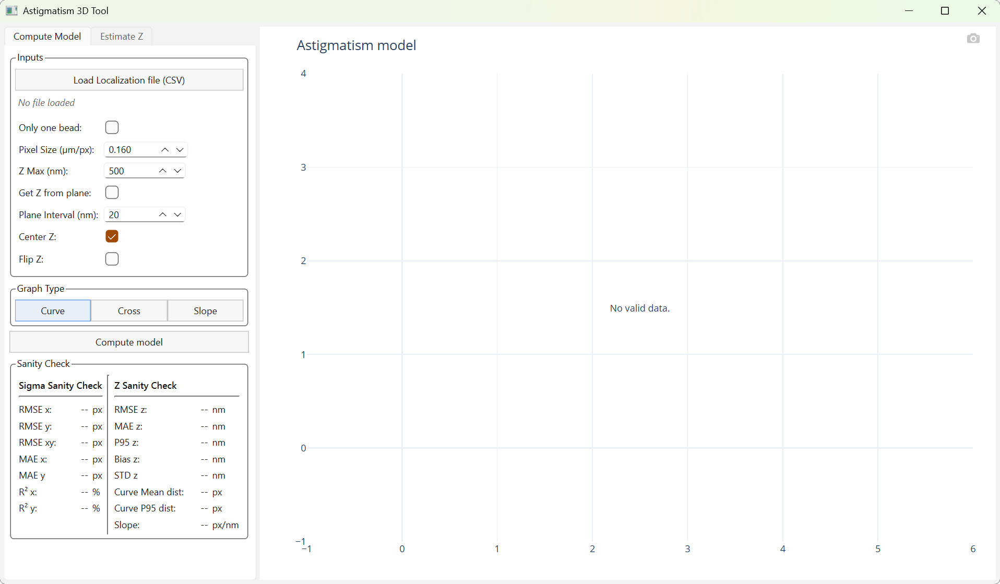
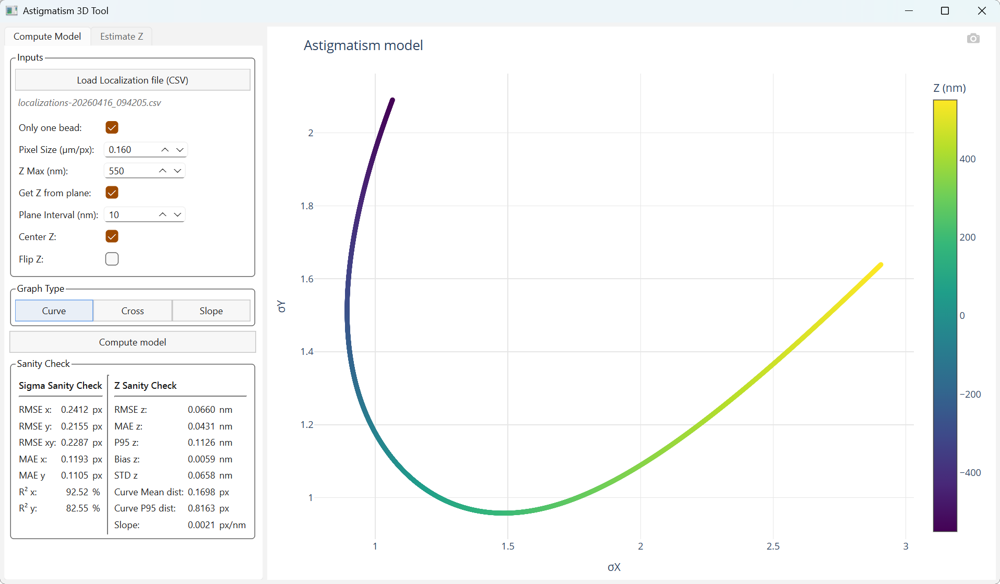
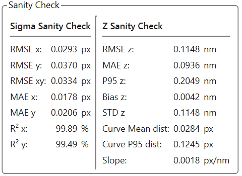
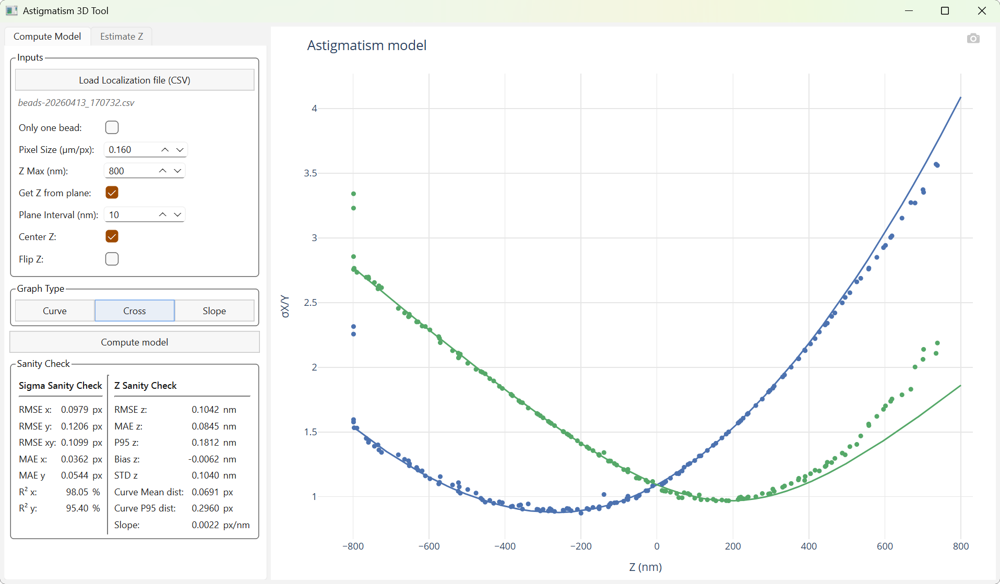
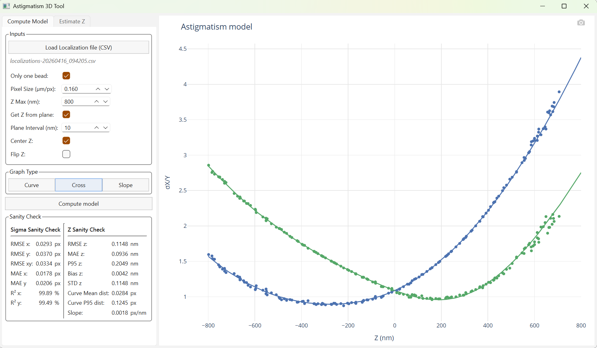
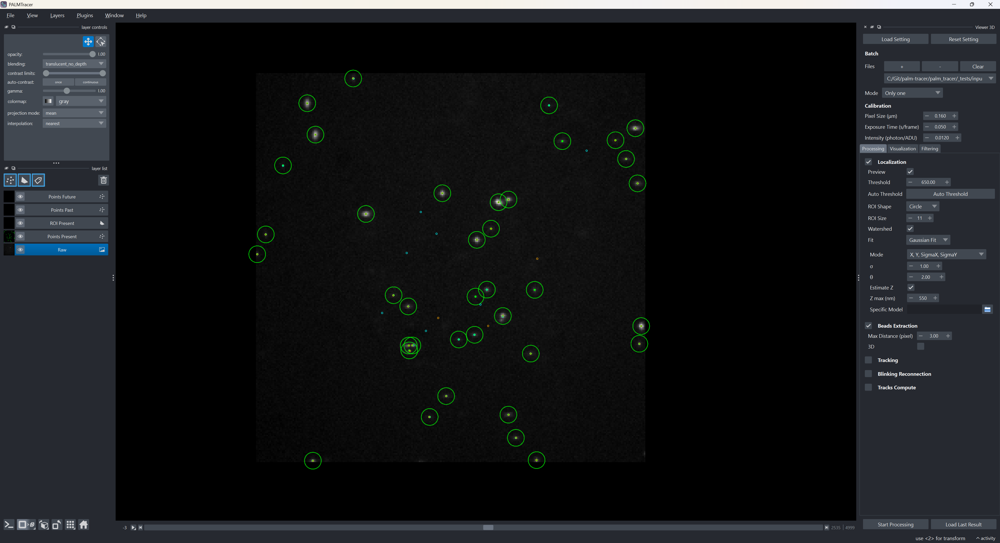
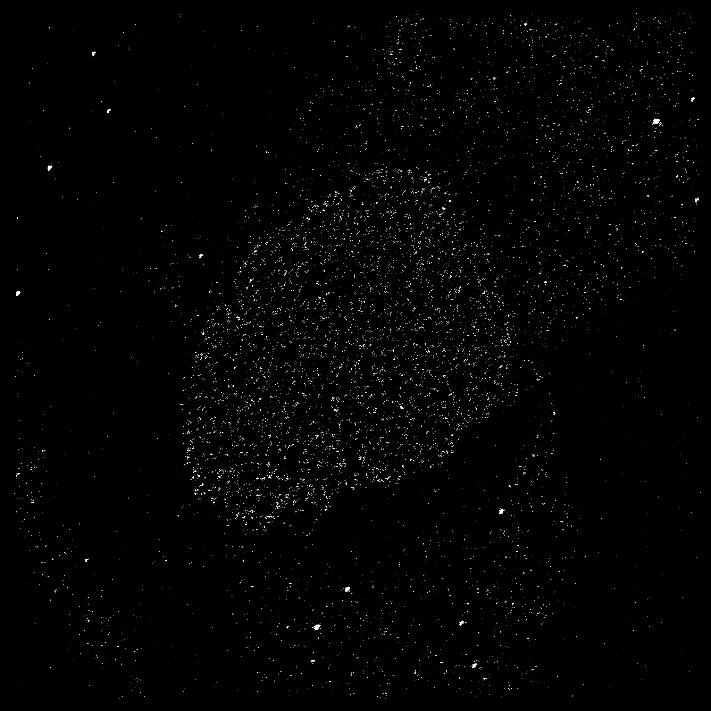
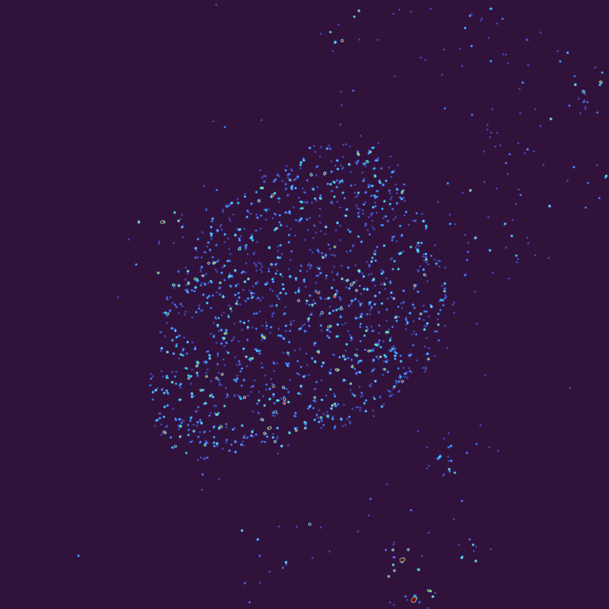

Cas 2 : Astigmatism 3D
===================================================

.. figure:: ../../_static/img/WIP.png
   :figclass: centered-caption
   :alt: Work In Progress
   :align: center
   :width: 50%
   :target: ../../_static/img/WIP.png

Contexte : L’astigmatisme 3D est une technique de microscopie de super-résolution permettant d’estimer la position axiale (Z) des molécules individuelles à partir de la déformation de leur PSF.
En introduisant une aberration astigmatique dans le système optique, la PSF devient elliptique : sa largeur selon X et Y varie en fonction de la profondeur.
Cette dépendance entre la forme de la PSF et la position axiale permet de reconstruire des localisations 3D à partir d’images 2D.
Dans ce cas d’utilisation, nous allons explorer comment utiliser Napari et PALMTracer pour calibrer un modèle astigmatique et analyser des données de localisation 3D.

Ouvrir Napari et PALMTracer
---------------------------------------------------

Suivez les instructions d'installation pour PALMTracer, puis lancez-le (plus d'informations :ref:`ici <install_page>`).
Assurez-vous que vous avez les données de calibrations et d'analyses prêtes à être analysées.

.. note:: La méthode d'accès aux données peut être une source de ralentissement.
	Si vous accédez à vos données via un réseau, il est recommandé de les copier localement pour accélérer le traitement.
	De plus, si vous avez des données volumineuses, assurez-vous d'avoir suffisamment de mémoire RAM pour les traiter efficacement.
	Un fichier de 20Go nécessite au moins 32Go de RAM. En dessous de cette limite, d'importants ralentissements pourront être présents.

Récupérer les données de calibration
---------------------------------------------------

Ouvrir le fichier de données
^^^^^^^^^^^^^^^^^^^^^^^^^^^^^^^^^^^^^^^^^^^^^^^^^^^

<!-- C:\Git\palm-tracer\palm_tracer\_tests\input\big input\DNA_PAINT_Eva\3D_callib\560nm_3D-stack.stk -->

Dans notre exemple, nous avons des données de calibration sous forme d'un fichier :file:`STK` (:file:`calib3D.stk`) de Metamorph
(il s'agit simplement d'un fichier :file:`TIFF` mais Metamorph insère sa propre extension).
Nous avons 1 fichier de 201 Frames de taille 512x512.

Pour commencer le traitement, nous allons charger le fichier.
Vous pouvez cliquer sur le bouton :guilabel:`+` dans la section Batch du plugin PALMTracer, allez chercher votre fichier pour l'ajouter.

.. figure:: ../../_static/img/manual/Batch.png
   :figclass: centered-caption
   :alt: Paramètres de Batch.
   :align: center
   :width: 25%
   :target: ../../_static/img/manual/Batch.png

Une fois le fichier chargé, vous avez une prévisualisation de votre pile (par défaut positionné au plan central de la pile).
Vous pouvez modifier le contraste et la colormap pour bien visualiser les données.
Vous pouvez parcourir les plans avec les flèches gauche et droite du clavier ou directement sur le bas de la partie visualisation de Napari.

.. figure:: ../../_static/img/examples/Napari_Basic.png
   :figclass: centered-caption
   :alt: Paramètres de Batch.
   :align: center
   :width: 80%
   :target: ../../_static/img/examples/Napari_Basic.png

L'initialisation des paramètres de localisation
^^^^^^^^^^^^^^^^^^^^^^^^^^^^^^^^^^^^^^^^^^^^^^^^^^^

La première étape consiste à trouver les paramètres de localisation optimaux pour vos données.
Il suffit de cliquer sur localisation pour activer cette étape de traitement, puis de cliquer sur le bouton :guilabel:`Preview`
pour voir les points détectés en temps réel sur votre image.

Le bouton :guilabel:`Auto Threshold` permet de trouver un seuil de détection automatique, mais il est souvent nécessaire de le modifier.

On active le fit gaussien avec l'option :guilabel:`X, Y, SigmaX, SigmaY`

En naviguant dans les plans, on peut voir que les PSF des points détectés changent de forme selon le plan, c'est l'effet de l'astigmatisme qui va permettre de faire la calibration ensuite.
Vous pouvez, ainsi, estimer si vos réglages sont bons ou pas : vous devez avoir des PSF qui vont du premier au dernier plan sans interruption.
Dans notre cas, nous remarquons un dédoublement des points à partir du plan 190.
La raison est simple, avec un décalage trop important par rapport au centre l'ajustement gaussien ne permet plus de correctement distinguer les points.

.. list-table::
   :align: center
   :widths: 50 50
   :class: image-grid

   * - .. figure:: ../../_static/img/examples/astig/Preview_1.png
          :figclass: centered-caption
          :alt: Détection sur un plan central
          :width: 95%
          :target: ../../_static/img/examples/astig/Preview_1.png

          Détection sur un plan central

     - .. figure:: ../../_static/img/examples/astig/Preview_2.png
          :figclass: centered-caption
          :alt: Détection sur un plan extrême
          :width: 95%
          :target: ../../_static/img/examples/astig/Preview_2.png

          Détection sur un plan extrême

Plusieurs options sont à votre disposition pour régler ce problème :

- Couper les plans extrêmes, en effet ces localisations sont faussées par leur distance au plan d'acquisition et donc difficiles à traiter.
- Ajuster le seuil, mais il est possible que ça ne suffise pas et devienne compliqué à gérer. L'option auto threshold peut être lancée sur plusieurs plans afin de vérifier que le seuil est adapté à tous les plans.
- Sélectionner une zone avec une ou plusieurs PSF qui sont propres du début à la fin.

Comme souvent, il va falloir jouer un peu sur les 3 tableaux et trouver un compromis satisfaisant.
De plus, le Watershed est activé, ce qui permet de séparer les points proches. Nous ne souhaitons pas ce comportement pour la calibration, il est donc préférable de le désactiver.

Pour sélectionner une zone et un sous-ensemble de plans, vous pouvez utiliser la partie :guilabel:`Filtering` avec des limitations sur les plans, l'axe X et l'axe Y.
Un Carré rouge apparaitra lors de la sélection de filtres sur X ou Y.

.. note:: Pour que les éléments filtrés soient enregistrés dans un fichier, il faut que le bouton :guilabel:`Save Filtered` soit actif. Sinon, seul le fichier de localisation brute sera enregistré.

          Il est recommandé d'utiliser des outils comme ImageJ pour faire une sélection plus précise, la garder en mémoire et l'importer dans Napari pour faire la calibration uniquement sur cette zone.
          Cela peut vous éviter d'avoir à gérer les filtres pour le moment. De plus, ImageJ possède de nombreux outils vous permettant de vérifier la taille et la forme des PSF plus précisément que la prévisualisation de Napari.

L'angle des échantillons
^^^^^^^^^^^^^^^^^^^^^^^^^^^^^^^^^^^^^^^^^^^^^^^^^^^

Maintenant, nous allons régler l'angle thêta de l'ajustement gaussien. Il est possible d'utiliser l'option :guilabel:`X, Y, SigmaX, SigmaY, Theta` pour l'ajustement gaussien.
Durant la prévisualisation, vous avez dans le terminal des informations sur les angles des points détectés dans le plan précédent, actuel et suivant.
Il s'agit d'un indicateur vous permettant de trouver une orientation globale pour votre échantillon.
En effet, si vous avez une orientation globale de votre échantillon, il est préférable de faire la calibration avec un thêta fixe pour éviter les erreurs de thêta qui peuvent arriver sur certains points et fausser la calibration.

.. note:: Si vous utilisez les filtres, au lieu d'avoir créé un fichier minimal, ces informations ne sont que des indicateurs partiels.
          Leurs pertinences peuvent dépendre de vos données et elles sont calculées avant le filtrage.
          Donc si vous avez filtré des éléments sur une zone, l'ensemble des localisations seront utilisées.

          Vous pouvez utiliser le Graphviewer pour faire une visualisation plus précise de la distribution des angles et trouver une valeur globale qui vous semble cohérente.
          Vous pouvez également analyser le fichier de localisation brute pour trouver une valeur de thêta qui correspond à l'orientation de votre échantillon.

.. warning:: Les angles sont toujours exprimés en degrés. Si vous analysez vos données dans d'autres logiciels, il est possible qu'ils n'acceptent que les radians.
             Assurez-vous de faire la conversion en radians si nécessaire.

Extraction des billes
^^^^^^^^^^^^^^^^^^^^^^^^^^^^^^^^^^^^^^^^^^^^^^^^^^^

Maintenant que nous avons trouvé des paramètres de localisation qui nous semblent corrects, nous pouvons lancer la localisation sur l'ensemble de la pile.
Il suffit de cliquer sur le bouton :guilabel:`Start Processing` pour lancer la localisation avec un fit gaussien permettant le calcul des sigmas anisotropes
(option :guilabel:`X, Y, SigmaX, SigmaY` et un théta (:math:`\theta`) fixe préalablement calculé).

À partir de ce moment, vous aurez un fichier de localisation brute qui sera enregistré dans le dossier dédié (:file:`calib3D_PALM_Tracer`),
ainsi qu'un fichier de localisation filtrée si vous avez activé des filtres et l'option :guilabel:`Save Filtered`.

Vous avez maintenant un fichier avec, du plan 1 à N, des localisations, mais possiblement plusieurs billes par plan.
Ce choix implique que les billes doivent être identifiées. En effet, à différents endroits du plan, rien n'indique que nos billes sont exactement à la même position axiale Z.

Sous la localisation vous avez l'étape d'extraction de billes.
Il va chercher dans vos localisations celles qui sont proches (dans un rayon défini par le paramètre :guilabel:`Max Distance`) et
qui sont présentes dans l'ensemble des plans, donc sans interruption, avec une tolérance si vous n'avez aucune localisation sur les premiers ou derniers plans,
mais vous avez sans doute filtré les plans extrêmes ou fait un fichier contenant uniquement la zone et les plans utiles.

Vous pouvez voir un fichier :file:`calib3D_PALM_Tracer/Beads_TIMESTAMP.csv` qui contient les localisations des billes extraites et identifiées.
De plus, le log affiché dans le terminal, qui est enregistré dans un fichier :file:`calib3D_PALM_Tracer/log_TIMESTAMP.log`, vous indique le nom du fichier utilisé, le nombre de localisations traitées, le nombre de billes déduites.

.. warning:: Il est possible que vos données ne puissent être suffisamment propres pour extraire des billes.

   Dans ce cas, il faudra utiliser le fichier de localisation, lors de l'étape suivante, et le forcer à ne prendre qu'une bille par plan avec l'option :guilabel:`Only one Bead`,
   mais cela peut rendre la calibration plus difficile et moins précise. Il est donc préférable d'avoir des données de calibration de bonne qualité pour cette étape.
   Au moins un plan ne doit contenir qu'une seule localisation pour qu'il la considère comme position standard de la bille et puisse faire sa sélection sur les plans contenant plusieurs localisations.

Calculer le modèle d'astigmatisme 3D
---------------------------------------------------

Maintenant que nous avons les localisations des billes extraites, nous pouvons calculer le modèle d'astigmatisme 3D.
Ce modèle reflète la position axiale en Z en fonction de la différence de forme des PSF. Il est calculé à partir des localisations des billes extraites et de leurs positions axiales Z connues.

Astigmatism 3D Tool
^^^^^^^^^^^^^^^^^^^^^^^^^^^^^^^^^^^^^^^^^^^^^^^^^^^

L'outil est indépendant de Napari, il peut être lancé depuis le menu :menuselection:`Plugins --> PALM Tracer --> Astigmatism 3D Tool` (plus d'informations :ref:`ici <tool_astig_page>`).

Il suffit de sélectionner le fichier :file:`Beads_TIMESTAMP.csv` et de définir les paramètres de calibration.

- :guilabel:`Only one Bead` doit être activée, si vous ne voulez pas moyenner les billes entre elles, et n'en conserver qu'une seule. Sinon, le modèle sera calculé à partir de l'ensemble des billes extraites.
  Il doit obligatoirement être activé si vous n'avez pas effectué l'étape d'extraction des billes et que vous possédez un fichier de localisation brute.
- :guilabel:`Pixel Size`, la résolution spatiale doit être indiquée pour que les unités soient cohérentes, elle doit être la même que celle utilisée lors de la localisation.
- :guilabel:`Z max` permet de borner les calculs et éviter que le modèle ne soit perturbé par des aberrations.
- :guilabel:`Get Z from plane` permet d'activer le calcul de Z à partir du numéro du plan, car notre localisation initiale ne contient pas d'informations sur cet axe.
  Cette option devra toujours être activée dans notre exemple de traitement, mais si vous avez un fichier de localisation avec une colonne Z déjà remplie, vous pouvez la désactiver et utiliser cette colonne pour faire la calibration.
- :guilabel:`Plane Interval` sert justement à préremplir la colonne Z à partir du numéro des plans (on suppose que les plans sont régulièrement espacés par cette valeur).
- :guilabel:`Center Z` permet de définir Z à 0 sur la position où Sigma X et Sigma Y sont égaux. (Par défaut, il faut toujours conserver cette option activée).
- :guilabel:`Flip Z` permet de pallier à une inversion de convention expérimentale (l'acquisition est effectuée du plan le plus bas vers le plus haut ou inversement).
  L’affichage des courbes du modèle vous permettra de définir si une inversion est nécessaire ou pas.

Une fois les paramètres réglés, vous pouvez lancer le calcul du modèle d'astigmatisme 3D en cliquant sur le bouton :guilabel:`Compute model`. Celui-ci génère un fichier :file:`astigmatism_3d_model.csv` dans le dossier du fichier de calibration.

Vérification de la cohérence
^^^^^^^^^^^^^^^^^^^^^^^^^^^^^^^^^^^^^^^^^^^^^^^^^^^

Vous avez en dessous du bouton de calcul un tableau de valeurs permettant de vérifier la cohérence du modèle.
Ces métriques sont divisées en deux colonnes, la partie gauche concerne les métriques d'erreur sur les observations (SigmaX, SigmaY) par rapport au modèle, tandis que la partie droite concerne les métriques d'erreur sur l'estimation de Z à partir du modèle.

- **RMSE** (*Root Mean Square Error*) : racine de la moyenne des erreurs quadratiques.
  Mesure l'erreur typique en pénalisant davantage les grandes erreurs.
  Modèle parfait : RMSE = 0 (en pratique, proche de l'écart-type du bruit si les données sont bruitées).
- **MAE** (*Mean Absolute Error*) : moyenne des erreurs absolues.
  Mesure l'erreur moyenne en valeur absolue, moins sensible aux aberrations que le RMSE.
  Modèle parfait : MAE = 0 (en pratique, proche de l'amplitude moyenne du bruit).
- **R²** (*coefficient de détermination*) : fraction de la variance des observations expliquée par le modèle.
  Modèle parfait : R² = 1.0. Un R² proche de 0 indique que le modèle n'explique pas mieux que la moyenne.
  Note : R² peut être négatif si le modèle est très mauvais.

- **P95 z** : 95e percentile de :math:`\Delta Z`. Indique une borne haute réaliste de l'erreur axiale pour la majorité des localisations.
- **Bias z** : Moyenne de :math:`\Delta Z`. Reflète un biais systématique du modèle.
  Modèle parfait : Bias = 0.
- **Std z** : Écart-type de :math:`\Delta Z`. Mesure la dispersion de l'erreur axiale autour du biais.
- **Curve mean distance** : Distance moyenne (en pixels) des points observés à la courbe modèle dans l'espace (:math:`\sigma_x, \sigma_y`). Sert de score de cohérence / confiance.
- **Curve p95 distance** : 95e percentile de la distance à la courbe. Utile pour définir un seuil de rejet des estimations peu fiables.
- **Slope mean** : Pente moyenne de la courbe :math:`\sigma_x(z)-\sigma_y(z)` en pixel par nanomètres.

Courbes
^^^^^^^^^^^^^^^^^^^^^^^^^^^^^^^^^^^^^^^^^^^^^^^^^^^

Trois types de courbes sont affichables pour visualiser le modèle d'astigmatisme 3D calculé :

- **Courbe Standard** : :math:`\sigma_x` et :math:`\sigma_y` en fonction de Z. Permet de visualiser la forme de la PSF en fonction de la profondeur.
- **Courbe de croisement** : Sépare chaque axe du modèle pour montrer deux courbes de Z en fonction d'un :math:`\sigma`.
  Le croisement des deux courbes s'effectue lorsque les sigmas sont égaux et Z vaut 0 si le modèle est correctement centré.
  Les points ayant servi au calcul du modèle sont affichés sur ces courbes, ce qui permet de visualiser la qualité de l'ajustement du modèle aux données.
- **Courbe de pente** : :math:`\sigma_x - \sigma_y` en fonction de Z. Permet de visualiser la "pente" du modèle, une valeur en pixel / nanomètre pour une différence de sigma.
  Les points ayant servi au calcul du modèle sont affichés sur la courbe, ce qui permet de visualiser la qualité de l'ajustement du modèle aux données.

.. list-table::
   :align: center
   :widths: 33 33 33
   :class: image-grid

   * - .. figure:: ../../_static/img/examples/astig/Curve.png
          :figclass: centered-caption
          :alt: Courbe Standard du modèle d'astigmatisme 3D.
          :width: 95%
          :target: ../../_static/img/examples/astig/Curve.png

          Courbe Standard du modèle d'astigmatisme 3D.

     - .. figure:: ../../_static/img/examples/astig/Cross.png
          :figclass: centered-caption
          :alt: Courbe de Croisement du modèle d'astigmatisme 3D.
          :width: 95%
          :target: ../../_static/img/examples/astig/Cross.png

          Courbe de Croisement du modèle d'astigmatisme 3D.

     - .. figure:: ../../_static/img/examples/astig/Slope.png
          :figclass: centered-caption
          :alt: Courbe de Pente du modèle d'astigmatisme 3D.
          :width: 95%
          :target: ../../_static/img/examples/astig/Slope.png

          Courbe de Pente du modèle d'astigmatisme 3D.

.. warning:: Voir avec JB pour expliquer certaines chelouittude classiques possibles des courbes et ce que cela signifie (mauvaise acquisition, identification de billes, etc.)

Exemple de réglages et conséquences
^^^^^^^^^^^^^^^^^^^^^^^^^^^^^^^^^^^^^^^^^^^^^^^^^^^

Lors d'un test préliminaire, nous avons calculé nos localisations avec une zone d'ajustement de 7x7 pixels et un thêta à 0°, ce qui n'a pas permis de récupérer la taille et la forme des PSF de manière cohérente.
Voici le résultat des métriques calculées sur ce modèle, ainsi que les courbes du modèle d'astigmatisme 3D.

On peut voir que la courbe sur Y se décale fortement des données de calibrations.
De plus, dans le terminal, vous pouvez voir le résultat présenté comme ceci :

.. code-block:: console

   Model for bead 1:
              Z0           W        C3        C4           A
   X -265.839906  392.976044  0.161871  0.187282  140.435719
   Y  192.561025  370.000000  0.000000  0.000000  154.941858
   	Model Calibration keep initial state on axis Y.

Pour que l'ensemble de la PSF soit dans la zone d'ajustement, nous avons augmenté la taille à 11x11 pixels, et nous avons trouvé un thêta à 2° qui correspondait à l'orientation de notre échantillon.

.. code-block:: console

   Model for bead 1:
              Z0           W        C3        C4           A
   X -276.593675  444.232059  0.103909  0.453582  143.030625
   Y  187.981664  318.426674  0.333546  0.088310  153.213744
   Model saved successfully.

En augmentant la limite Z (avec :guilabel:`Z max`), on voit (sur les courbes ci-dessous) que les points de références s'éloignent de la courbe à distance élevée par rapport au centre,
ce qui montre les limites de la localisation en Z du modèle d'astigmatisme 3D par localisation gaussienne.
En effet, si vous vous rappelez au début, des PSF trop étirées sont vues comme deux points proches.
A contrario, si vous avez une limite Z trop basse, vous risquez d'avoir de nombreux points à la limite de cette zone.
La vérification de la cohérence cherchant à comparer les trios de valeur :math:`(\sigma_x, \sigma_y, z)`, il va prendre en compte ce maximum défini lors d'estimations et les résultats de la cohérence seront moins bons.

.. list-table::
   :align: center
   :widths: 50 50
   :class: image-grid

   * - .. figure:: ../../_static/img/examples/astig/Cross_lowZ.png
          :figclass: centered-caption
          :alt: Courbe de Croisement du modèle d'astigmatisme 3D avec une limite Z basse.
          :width: 95%
          :target: ../../_static/img/examples/astig/Cross_lowZ.png

          Courbe de Croisement du modèle d'astigmatisme 3D avec une limite Z basse.

     - .. figure:: ../../_static/img/examples/astig/Cross.png
          :figclass: centered-caption
          :alt: Courbe de Croisement du modèle d'astigmatisme 3D avec une limite Z élevée.
          :width: 95%
          :target: ../../_static/img/examples/astig/Cross.png

          Courbe de Croisement du modèle d'astigmatisme 3D avec une limite Z élevée.

   * - .. figure:: ../../_static/img/examples/astig/Slope_lowZ.png
          :figclass: centered-caption
          :alt: Courbe de Pente du modèle d'astigmatisme 3D avec une limite Z basse.
          :width: 95%
          :target: ../../_static/img/examples/astig/Slope_lowZ.png

          Courbe de Pente du modèle d'astigmatisme 3D avec une limite Z basse.

     - .. figure:: ../../_static/img/examples/astig/Slope.png
          :figclass: centered-caption
          :alt: Courbe de Pente du modèle d'astigmatisme 3D avec une limite Z élevée.
          :width: 95%
          :target: ../../_static/img/examples/astig/Slope.png

          Courbe de Pente du modèle d'astigmatisme 3D avec une limite Z élevée.

   * - .. figure:: ../../_static/img/examples/astig/Metrics_lowZ.png
          :figclass: centered-caption
          :alt: Métriques du modèle d'astigmatisme 3D avec une limite Z basse.
          :width: 50%
          :target: ../../_static/img/examples/astig/Metrics_lowZ.png

          Métriques du modèle d'astigmatisme 3D avec une limite Z basse.

     - .. figure:: ../../_static/img/examples/astig/Metrics.png
          :figclass: centered-caption
          :alt: Métriques du modèle d'astigmatisme 3D avec une limite Z élevée.
          :width: 50%
          :target: ../../_static/img/examples/astig/Metrics.png

          Métriques du modèle d'astigmatisme 3D avec une limite Z élevée.

Appliquer le modèle
---------------------------------------------------

Maintenant, nous allons utiliser le modèle, on ouvre notre fichier d'acquisition :file:`GFP.stk`.
Pour utiliser le modèle, on a le choix entre copier le fichier :file:`astigmatism_3d_model.csv` dans le dossier de notre fichier d'analyse ou de lui indiquer le chemin du modèle à utiliser.
Nous allons le copier, car plusieurs fichiers sont présents dans ce dossier et tous utiliseront le même modèle et je préfère éviter d'avoir à indiquer le chemin du modèle à chaque fois, mais vous pouvez faire comme bon vous semble.

Pour commencer, nous allons lancer le calcul d'auto threshold sur plusieurs plans afin d'estimer un seuil moyen pour l'ensemble de la pile.
Cela permet d'éviter de lancer l'auto seuil sur l'unique plan plus lumineux/sombre par rapport aux autres sans s'en rendre compte.
Nous trouvons pour notre exemple un seuil de 650 qui semble cohérent pour l'ensemble de la pile.

On fixe les paramètres qui ont été utilisés pour le modèle de calibration, une zone d'ajustement de 11x11 pixels, un thêta fixé à 2° et on active l'ajustement gaussien avec l'option :guilabel:`X, Y, SigmaX, SigmaY`.
On coche l'option :guilabel:`Estimate Z` et on indique une limite  :guilabel:`Z max` de 550nm pour éviter les aberrations sur les points trop éloignés du plan d'acquisition et une limite trop proche qui va créé un pôle de points à cette limite.

.. note:: Il est également possible de volontairement choisir un seuil plus bas et un Z plus élevé et ensuite filtrer les résultats.

On coche également l'étape de traitement :guilabel:`Beads Extraction`.
Cela permettra de voir si durant la localisation, des billes sont clairement identifiables.
Ces billes serviront plus tard à corriger les dérives éventuelles de l'acquisition.

.. code-block:: console

   [24-04-2026 10:50:03] Log opened : C:\Cell1\GFP_PALM_Tracer/log-20260424_105003.log
   [24-04-2026 10:50:03] Start Processing.
   [24-04-2026 10:50:03] Output folder: C:\Cell1\GFP_PALM_Tracer
   [24-04-2026 10:50:03] Settings saved.
   [24-04-2026 10:50:03] Meta file saved.
   [24-04-2026 10:50:03] Localization enabled.
   [24-04-2026 10:50:06] 	Saving the localization file (182395 localization(s) found).
   [24-04-2026 10:50:13] Beads Extraction enabled.
   [24-04-2026 10:51:26] 	Saving the beads file (5 beads(s) found).
   .................
   [24-04-2026 10:51:27] Log closed : C:\Git\palm-tracer\palm_tracer\_tests\input\big input\DNA_PAINT_Eva\250922_U2OS_NUP96\Cell1\GFP_R4_50pM_18mW_001_PALM_Tracer/log-20260424_105003.log

Première reconstruction
---------------------------------------------------

Pour lancer le module de reconstruction, il suffit de cliquer sur le bouton :guilabel:`Viewer HR` dans l'onglet :guilabel:`Visualization` (plus d'informations :ref:`ici <viewer_hr_page>`).

Pour une première reconstruction, nous n'avons pas appliqué de filtres, nous voulons avoir un premier aperçu de la qualité de la reconstruction avant de faire des choix de filtrage.
Comme nous avons pu identifier des billes précédemment, nous allons les utiliser pour faire une correction de dérive avant de faire la reconstruction.

.. warning:: L'extraction des billes doit se faire sans filtres de position ou de plan, si elles sont en dehors de la zone que vous souhaitez analyser à postériori, vous n'aurez qu'à conserver le fichier de bille initial et ne pas les recalculer durant un processus.

Filtrer les résultats
---------------------------------------------------

.. warning:: Je n'arrive pas à avoir une belle reconstruction avec une NUP. Comme je ne fais jamais d'analyses, j'y vais au pifomètre, il faudrait que quelqu'un arrive à le faire et me passe les différents réglages et screenshots pour que je puisse les modifier. Il y a aussi peut-être une erreur dans mon pipeline ou la reconstruction peut-être mal implémentée. Malgré tous les tests, une chose a pu m'échapper.

Il faut maintenant filtrer un peu nos résultats pour faire une reconstruction de bonne qualité, mais il est important de ne pas faire un filtrage trop strict pour ne pas perdre trop d'informations et ne pas créer de trous dans la reconstruction.
Pour ce faire, nous allons commencer par analyser nos résultats dans le Graph Viewer (plus d'informations :ref:`ici <viewer_graph_page>`).

On va commencer par réduire l'amplitude des intensités intégrées pour ne pas avoir des points trop lumineux/trop sombres qui ont été localisés et créer des artefacts dans la reconstruction.

.. list-table::
   :align: center
   :widths: 50 50
   :class: image-grid

   * - .. figure:: ../../_static/img/examples/astig/GV_I.png
          :figclass: centered-caption
          :alt: Courbe de Croisement du modèle d'astigmatisme 3D avec une limite Z basse.
          :width: 95%
          :target: ../../_static/img/examples/astig/GV_I.png

          Courbe initiale

     - .. figure:: ../../_static/img/examples/astig/GV_I_Filtered.png
          :figclass: centered-caption
          :alt: Courbe de Croisement du modèle d'astigmatisme 3D avec une limite Z élevée.
          :width: 95%
          :target: ../../_static/img/examples/astig/GV_I_Filtered.png

          Courbe filtrée

Pour cet exemple, on limite :

- L'intensité sur [80k, 300k]
- Le MSE sur XY inférieur à 0.90 (car il s'agit d'un indice de confiance sur la localisation).
- La position Z sur [-400, 400] nm pour éviter les points trop éloignés du plan d'acquisition.

.. list-table::
   :align: center
   :widths: 50 50
   :class: image-grid

   * - .. figure:: ../../_static/img/examples/astig/HR_1b.png
          :figclass: centered-caption
          :alt: Premier lancement de la reconstruction.
          :width: 95%
          :target: ../../_static/img/examples/astig/HR_1b.png

          Premier lancement de la reconstruction.

     - .. figure:: ../../_static/img/examples/astig/HR_2b.png
          :figclass: centered-caption
          :alt: Reconstruction sur des éléments filtrés.
          :width: 95%
          :target: ../../_static/img/examples/astig/HR_2b.png

          Reconstruction sur des éléments filtrés.

Rendu gaussien
---------------------------------------------------

Le rendu gaussien est un rendu plus réaliste que le rendu par points, il permet de visualiser la forme de la PSF en fonction des (:math:`\sigma_x, \sigma_y`).
Parmi les options, on voit choisir de fixer une intensité et une taille commune à tous les points restants après filtrage.
On peut faire varier la color map et le contraste pour faire ressortir les détails de la reconstruction.

Pour cet exemple, on définit l'intensité fixe pour tous les points à XXX (Intensité intégrée de la courbe gaussienne). La taille des PSF est fixe et définie par un écart-type de 1 pixel.

Second filtre sur une zone d'intérêt
---------------------------------------------------

Nous allons ajouter un filtre sur X et Y afin d'avoir une zone d'intérêt plus précise, par exemple un pore nucléaire, pour faire une reconstruction de cette zone uniquement.

Pour cet exemple, on limite X sur [XXX, XXX] pixels et Y sur [YYY, YYY] pixels.

.. note:: Lors de la sélection de ces filtres, un carré rouge apparaît sur la visualisation de Napari pour indiquer la zone sélectionnée. (Pour le moment, elle n'est visible que dans l'affichage principal, une mise à jour ultérieure permettra de la dessiner à la main dans n'importe quelle interface.)

.. figure:: ../../_static/img/WIP.png
   :figclass: centered-caption
   :alt: Reconstruction gaussienne filtrée sur une zone d'intérêt.
   :align: center
   :width: 50%
   :target: ../../_static/img/WIP.png

   Reconstruction gaussienne filtrée sur une zone d'intérêt.

Z Stack et 3D reconstruction
---------------------------------------------------

Deux reconstructions 3D sont possibles dans le viewer HR, chacune permet de représenter les points sous forme de spots (un voxel par localisation) ou de gaussiennes 3D isotropes.

Une reconstruction type Z-stack permet de faire une image tif 3D avec un intervalle en nanomètres par plan à définir au moment de la génération.
L'affichage Napari utilise une échelle uniforme en X, Y et Z.
Donc, si vous avez une résolution de 10nm par pixel, vous aurez 10nm par plans dans le visuel.
Mais vous pouvez passer l'affichage de la 2D à la 3D et ainsi, vous pouvez tourner autour de votre reconstruction dans un espace orthonormé.

.. figure:: ../../_static/img/WIP.png
   :figclass: centered-caption
   :alt: Bouton permettant de passer en mode 3D.
   :align: center
   :width: 50%
   :target: ../../_static/img/WIP.png

   Bouton permettant de passer en mode 3D.

La seconde, 3D rotation, permet de faire une reconstruction dans un espace orthonormé avec une rotation sur un des 3 axes (X, Y ou Z) avec un nombre de frames à indiquer pour effectuer un tour complet (ex : 36 correspond à une rotation de 10° par plans).

Script Version
---------------------------------------------------

blabla

FAQ
---------------------------------------------------

blabla
