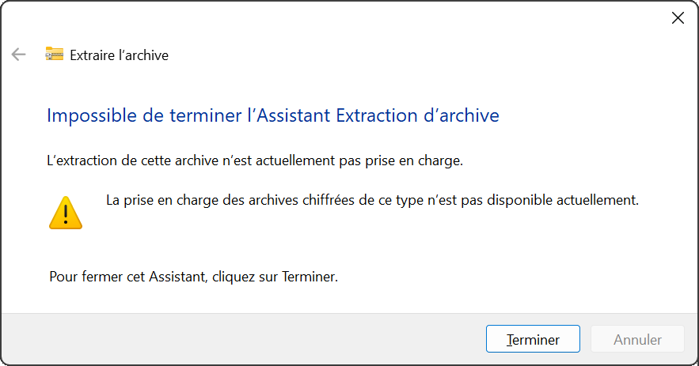

Installation
=====================================

.. role:: python(code)
   :language: python

.. role:: console(code)
   :language: console

Ce guide vous aidera à installer le projet étape par étape.

.. note::
   | Toutes les lignes de commandes décrites sont effectuées à partir de :console:`PowerShell` sous Windows (le terminal :console:`cmd` ne possède pas toujours la même syntaxe et sur les autres systèmes d'exploitation, des différences peuvent apparaitre).
   | De préférence, le terminal doit être lancé en mode administrateur pour éviter des problèmes de droits, dans le cas contraire, il est possible que des blocages apparaissent.
   | Dans le cadre d'utilisation par une session non administrateur, il est nécessaire de lancer avant les commandes :console:`Set-ExecutionPolicy -Scope Process -ExecutionPolicy Bypass` pour autoriser l'exécution de scripts dans la session en cours.

.. note::
   Les calculs sont effectués à partir d'une DLL, celle-ci est dans le fichier :console:`7z` à décompresser, vous devez connaitre le mot de passe pour le faire.

Étape 1 : Téléchargement de PalmTracer
----------------------------------------

Deux méthodes sont possibles pour récupérer le projet **PalmTracer**.
Si vous utilisez déjà **Git**, la première méthode est recommandée, car elle facilite le suivi des mises à jour. Une `(très) courte introduction à Git <https://tmonseigne.github.io/Intro_Git/>`_ est disponible si vous souhaitez débuter avec Git.
Sinon, vous pouvez télécharger une archive ZIP.

Méthode 1 (recommandée) : via Git
^^^^^^^^^^^^^^^^^^^^^^^^^^^^^^^^^

Si Git (ou GitKraken pour une utilisation avec une interface graphique) est installé sur votre machine, clonez simplement le dépôt :

.. code-block:: console

   cd C:\ (pour installer à la racine, mais vous pouvez le mettre où vous voulez)
   git clone https://github.com/tmonseigne/palm-tracer.git

Le dossier :console:`palm-tracer` sera alors créé dans le répertoire courant.

Vous devez maintenant dézipper le fichier :console:`DLL.7z`.
Faites un clic droit sur le fichier, :menuselection:`Afficher d'autres options --> 7-Zip --> Extraire ici`
Le mot de passe vous est demandé lors de l'extraction.
Le fichier extrait est automatiquement placé dans le dossier approprié (:console:`palm-tracer\\palm_tracer\\DLL`).

Méthode 2 : téléchargement manuel (ZIP)
^^^^^^^^^^^^^^^^^^^^^^^^^^^^^^^^^^^^^^^

1. Rendez-vous sur `la page GitHub du projet <https://github.com/tmonseigne/palm-tracer>`_.
2. Cliquez sur **Code** (le bouton vert).
3. Choisissez **Download ZIP** pour télécharger les fichiers du projet sur votre ordinateur.
4. Extrayez les fichiers dans un dossier accessible (par exemple, :console:`C:\\palm-tracer`).
5. Dezippez le fichier :console:`DLL.7z` :
    - Faites un clic droit sur le fichier, :menuselection:`Afficher d'autres options --> 7-Zip --> Extraire ici`
    - Le mot de passe vous est demandé lors de l'extraction.
    - Le fichier extrait est automatiquement placé dans le dossier approprié (:console:`palm-tracer\\palm_tracer\\DLL`).

.. note::
   | Attention, l'extraction avec l'outil intégré à Windows créé des sous-dossiers.
   | Si vous avez extrait dans :console:`C:\\palm-tracer`, vous devez avoir ensuite plusieurs dossiers et fichiers :console:`palm_tracer, docs, README.md...`.
	Ils ont peut être été mis dans un sous-dossier :console:`palm-tracer-master` et doivent être remonté d'un cran.

Étape 2 : Installation de Python et des éléments additionnels
------------------------------------------------------------------------

Vous pouvez utiliser `chocolatey <https://chocolatey.org/install>`_ pour gérer vos différents programmes et installation à partir de :console:`PowerShell` (nécessite des droits administrateur)

.. code-block:: console

   Set-ExecutionPolicy Bypass -Scope Process -Force; [System.Net.ServicePointManager]::SecurityProtocol = [System.Net.ServicePointManager]::SecurityProtocol -bor 3072; iex ((New-Object System.Net.WebClient).DownloadString('https://community.chocolatey.org/install.ps1'))

.. code-block:: console

   choco install python -y
   choco install visualstudio2022buildtools --includeRecommended -y
   choco install vcredist-all -y`

Sinon, vous pouvez tout faire manuellement :

1. Téléchargez Python 64-bit depuis le `site officiel <https://www.python.org/downloads/>`_.
2. Pendant l'installation, assurez-vous de cocher l'option **Add Python to PATH**.
3. Une fois installé, vérifiez que Python fonctionne :

   - Ouvrez un terminal ou une invite de commande (:console:`PowerShell` sur Windows).
   - Tapez la commande suivante :console:`python --version` et appuyez sur **Entrée**

.. note::
   Vous devriez voir une version de Python (par exemple, :console:`Python 3.x.x`).

   **Attention** : Si Python à changé de version récemment, certaines bibliothèques peuvent ne plus être compatible.
   Ex : au moment d'écrire ces lignes Python 3.14 est disponible mais Napari n'est pas encore compatible, il faut utiliser Python 3.13.

4. Les différentes bibliothèques nécessitent parfois des éléments additionnels pour fonctionner :

   - `Build Tools for Visual Studio <https://visualstudio.microsoft.com/fr/visual-cpp-build-tools/>`_. Pendant l'installation, assurez-vous de cocher **C++ build tools**
   - vcredist : celui-ci sera installé avec **Build Tools for Visual Studio**.

Étape 3 : Création d'un environnement virtuel (optionnel)
------------------------------------------------------------------------

Un environnement virtuel permet de gérer les dépendances du projet de manière isolée.

1. Ouvrez un terminal ou une invite de commande (:console:`PowerShell` sur Windows) dans le dossier où vous avez extrait les fichiers du projet.
   Exemple pour :console:`C:\\palm-tracer`. Ouvrez le terminal et tapez la commande suivante  :console:`cd C:\\palm_tracer` et appuyez sur **Entrée**
2. Créez un environnement virtuel avec la commande suivante :console:`python -m venv venv`
3. Activez l'environnement virtuel :

   - Sous Windows : :console:`.\\venv\\Scripts\\activate`
   - Sous macOS/Linux : :console:`source venv/bin/activate`

4. Vous verrez maintenant :console:`(venv)` au début de votre invite de commande, indiquant que l'environnement virtuel est actif.

Étape 4 : Installation du plugin
------------------------------------------------------------------------

1. Ouvrez un terminal ou une invite de commande (:console:`PowerShell` sur Windows) dans le dossier où vous avez extrait les fichiers du projet.
   Exemple pour :console:`C:\\palm-tracer`. Ouvrez le terminal et tapez la commande suivante  :console:`cd C:\\palm_tracer` et appuyez sur **Entrée**
2. Assurez-vous que l'environnement virtuel est activé si vous le souhaitez (voir Étape 3).
3. Installez les dépendances nécessaires avec la commande :

.. code-block:: console

   $env:SETUPTOOLS_SCM_PRETEND_VERSION_FOR_PALM_TRACER = "1.0.0"
   python -m pip install -e .[testing,documentation]

.. note::
   | La première ligne est nécessaire, si vous avez **téléchargé** le zip du code source à partir de Git.
   | Si vous avez **cloné** le dépôt, cela n'est plus nécessaire.
   | Les éléments supplémentaires tels que testing installent Napari entre autres éléments si vous ne l'aviez pas déjà.

Étape 5 : Lancement du plugin
------------------------------------------------------------------------

1. Ouvrez un terminal ou une invite de commande (:console:`PowerShell` sur Windows) dans le dossier où vous avez extrait les fichiers du projet.
   Exemple pour :console:`C:\\palm-tracer`. Ouvrez le terminal et tapez la commande suivante  :console:`cd C:\\palm_tracer` et appuyez sur **Entrée**
2. Assurez-vous que l'environnement virtuel est activé si vous le souhaitez (voir Étape 3).
3. Lancez Napari avec la commande : :console:`napari`

.. note::
   Si vous n'avez pas créé d'environnement virtuel, Napari peut être lancé depuis n'importe où.

4. Activez le plugin dans Napari : :menuselection:`Plugins --> PALM Tracer --> PALM Tracer`

Étape 6 : Supprimer la mise à l'échelle de Napari
------------------------------------------------------------------------
Napari utilise QT et celui-ci est paramétré sur la mise à l'échelle automatique de Windows
qui permet, notamment, d'agrandir l'interface sur les petits écrans ayant une résolution élevée.
Cela peut devenir parfois gênant, il est possible de modifier ce comportement.

1. Ouvrez un terminal ou une invite de commande (:console:`PowerShell` sur Windows).
2. Lancez la commande :console:`$env:QT_AUTO_SCREEN_SCALE_FACTOR="0"` dans :console:`PowerShell` sous Windows
   ou :console:`export QT_AUTO_SCREEN_SCALE_FACTOR=0` sous Linux et macOS.
3. Pour réactiver la mise à l'échelle, lancez la commande : :console:`Remove-Item Env:\\QT_AUTO_SCREEN_SCALE_FACTOR` dans :console:`PowerShell` sous Windows
   ou :console:`unset QT_AUTO_SCREEN_SCALE_FACTOR` sous Linux et macOS.

C'est terminé ! 🎉 Vous avez installé et configuré le plugin avec succès.

FAQ
---

1. Je n'arrive pas à dézipper la DLL ?
^^^^^^^^^^^^^^^^^^^^^^^^^^^^^^^^^^^^^^^^^^^^^^^^^^^^^^^^^^^^^^^^
Il est possible de voir apparaitre un message d'erreur lors de l'extraction.

   Erreur d'extraction

Cela signifie que votre Windows n'arrive pas à lire le fichier compressé. Vous avez très certainement 7-zip d'installé par défaut par votre administrateur.
Suivez les instrucitons décrites pour l'extraction.

2. Pourquoi utiliser un environnement virtuel ?
^^^^^^^^^^^^^^^^^^^^^^^^^^^^^^^^^^^^^^^^^^^^^^^^^^^^^^^^^^^^^^^^
Pour éviter les conflits entre les dépendances de différents projets. Ou nécessaire lorsque vous n'avez pas les droits administrateur sur votre système.

3. Et si je n'ai pas :console:`pip install` ?
^^^^^^^^^^^^^^^^^^^^^^^^^^^^^^^^^^^^^^^^^^^^^^^^^^^^^^^^^^^^^^^^
Cela signifie que Python n'est pas bien installé. Reprenez l'Étape 2 et assurez-vous d'avoir ajouté Python au :console:`PATH`.

4. Pourquoi, certaines commandes me mettent une erreur pour me dire que je n'ai pas les autorisations nécessaires ?
^^^^^^^^^^^^^^^^^^^^^^^^^^^^^^^^^^^^^^^^^^^^^^^^^^^^^^^^^^^^^^^^^^^^^^^^^^^^^^^^^^^^^^^^^^^^^^^^^^^^^^^^^^^^^^^^^^^^^^^^^^^^^^^^
Certaines commandes nécessitent des droits administrateur. Il faut lancer le terminal en mode administrateur sous Windows.

5. Où puis-je trouver plus d'aide ?
^^^^^^^^^^^^^^^^^^^^^^^^^^^^^^^^^^^^^^^^^^^^^^^^^^^^^^^^^^^^^^^^
Consultez la documentation officielle de Python ou contactez le support du projet.
