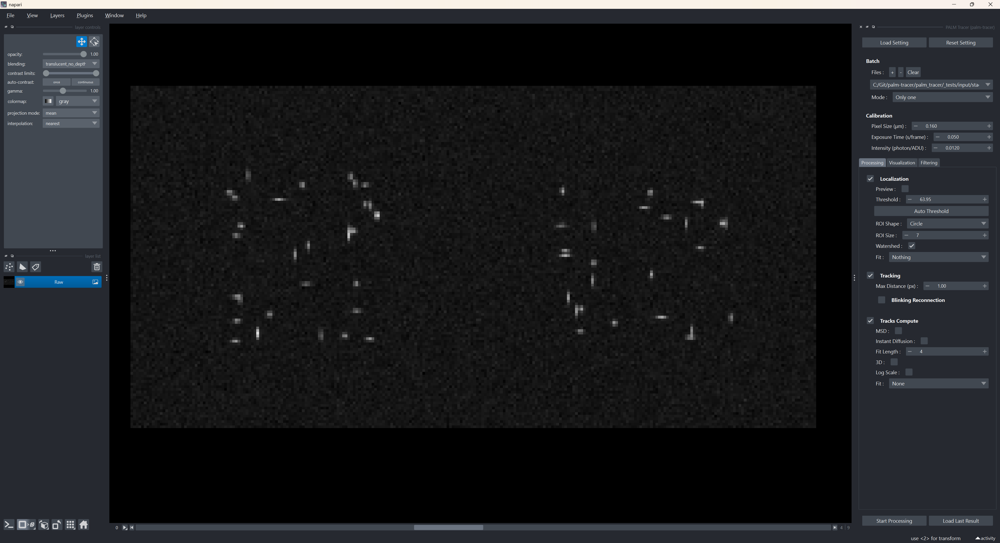
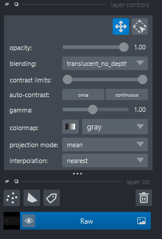
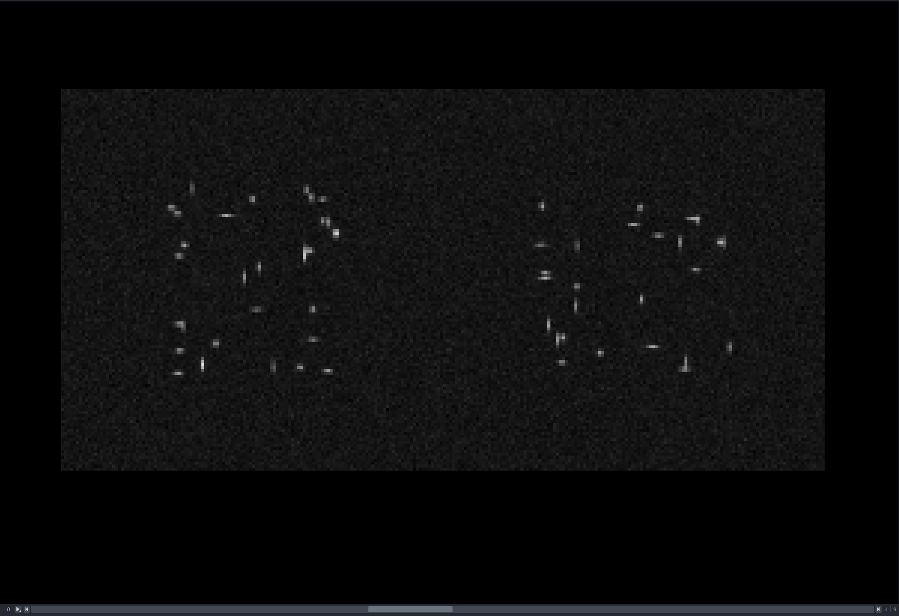
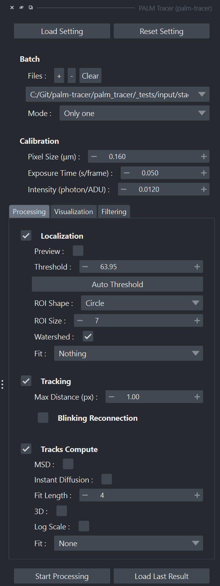
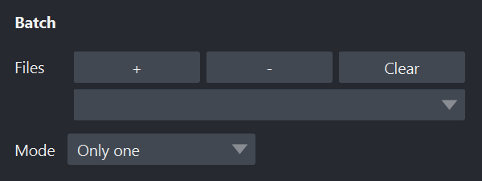
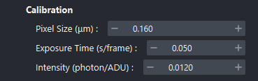
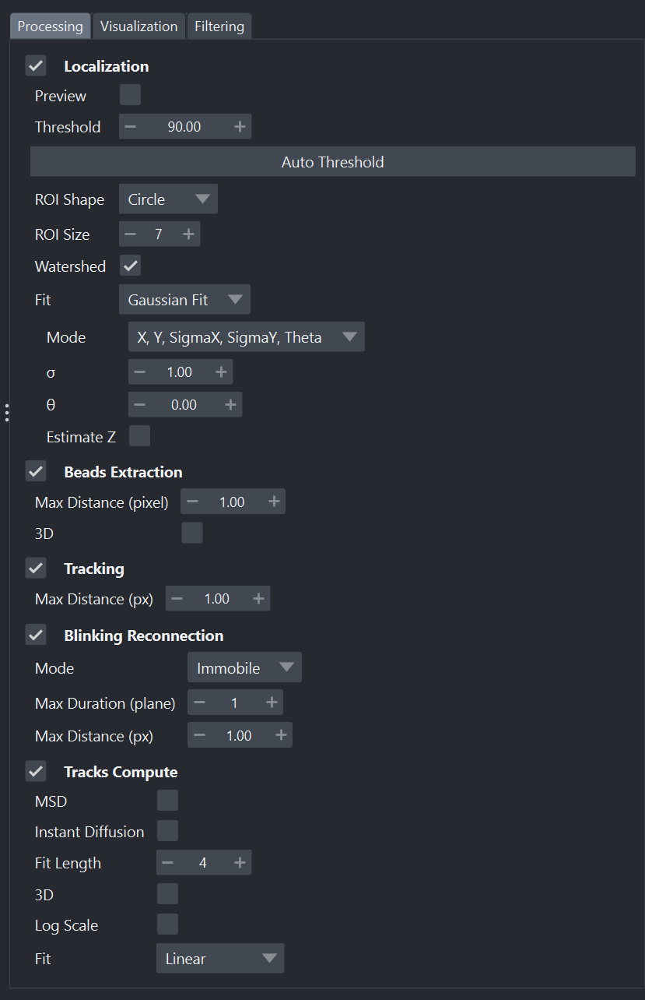
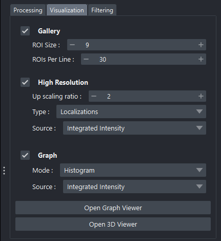
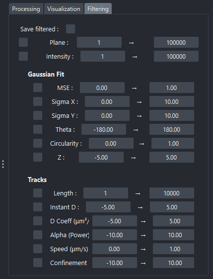

Manuel d'utilisation
=====================================

.. role:: python(code)
   :language: python

.. role:: console(code)
   :language: console

Ce guide décrit l'utilisation de PALMTracer, un plugin Napari, dédié à l'analyse de données PALM/STORM et au traitement des localisations, incluant preview, détection, suivi, visualisation 2D/3D et filtrage des résultats.

PALMTracer fonctionne comme un widget intégré dans l'interface de Napari, offrant un ensemble d'outils organisés en onglets : Processing, Visualization et Filtering.

Lancement
---------

1. Ouvrez un terminal ou une invite de commande (:console:`PowerShell` sur Windows) dans le dossier où vous avez extrait les fichiers du projet.
   Exemple pour :file:`C:\\palm-tracer`. Ouvrez le terminal et tapez la commande suivante  :console:`cd C:\\palm_tracer` et appuyez sur **Entrée**
2. Assurez-vous que l'environnement virtuel est activé si vous l'utilisez.
3. Lancez Napari avec la commande : :console:`napari`

.. note::
   Si vous n'avez pas créé d'environnement virtuel, Napari peut être lancé depuis n'importe où.

4. Activez le plugin dans Napari : :menuselection:`Plugins --> PALM Tracer --> PALM Tracer`

.. note::
   Il est possible de lancer Napari directement avec le plugin avec la commande : :console:`napari -w palm-tracer`

Organisation de l'interface
----------------------------------

L'interface Napari avec PALMTracer est organisée en trois volets principaux :

- À gauche : le panneau des calques (Layers)
- Au centre : la fenêtre de visualisation
- À droite : le widget PALMTracer

   Vue d'ensemble de Napari avec le widget PALMTracer

Volet Calque
^^^^^^^^^^^^^^^^^^^^^^^^^^^^^^^^^^

Le volet des calques est la zone où apparaissent tous les éléments visuels générés par PALMTracer :

- Image brute (Raw)
- Points détectés (Points Past / Present / Future)
- ROI des localisations
- Visualisation haute résolution
- Trajectoires (Tracks)
- Vues 3D ou graphiques externes

Fonctionnalités principales :

- Afficher / masquer un calque
- Modifier la transparence
- Changer la colormap
- Réorganiser l'ordre des calques

   Volet calque de Napari

Volet de visualisation
^^^^^^^^^^^^^^^^^^^^^^^^^^^^^^^^^^

La zone centrale de Napari affiche les données. Vous pouvez :

- Zoomer (molette de la souris)
- Vous déplacer (clic gauche maintenu)
- Changer de plan Z via la barre de dimension
- Régler le contraste

PALMTracer met automatiquement à jour cette zone à chaque changement de fichier ou lors de la preview.

   Volet de visualisation de Napari

Volet PALMTracer
^^^^^^^^^^^^^^^^^^^^^^^^^^^^^^^^^^

Le volet de droite contient le widget principal de PALMTracer.

Le widget est structuré comme suit :

- Partie haute :
   - Boutons :guilabel:`Load Setting` / :guilabel:`Reset Setting`
   - Batch (gestion des fichiers)
   - Calibration
- Onglets :
   - Processing
      - Paramètres de localisation
      - Paramètres de tracking
      - Paramètres de calcul sur les trajectoires
      - Bouton Start Processing (traitement en thread séparé)
   - Visualization
      - Galerie de ROI.
      - Visualisation haute résolution
      - Viewer 3D
      - Viewer graphique
   - Filtering
      - paramètres de filtrage des localisations et pistes
- Boutons :guilabel:`Start Processing` / :guilabel:`Load Last Result`

   Volet Widget de Napari

Ouverture de fichiers
----------------------------------

- Dans le volet PALMTracer, cliquez sur le bouton :guilabel:`+` dans la section :guilabel:`Batch`.
- Sélectionnez un fichier :file:`.tif` ou :file:`.tiff`.
- Vous pouvez ouvrir plusieurs fichiers successivement : ils apparaissent dans une liste déroulante.
- Le paramètre Mode permet de définir le comportement lors des traitements :

   - "Only one" : un seul fichier est analysé.
   - "Each File separately" : chaque fichier est analysé indépendamment.
   - "All in One" : Tous les fichiers sont combinés et analysés comme un seul ensemble.

Lorsqu'un fichier est sélectionné, PALMTracer :

- Efface les anciens calques.
- Charge automatiquement le fichier dans un calque Raw.
- Mets à jour la preview si elle est activée.

   Paramètres de Batch

Calibration de l'acquisition
----------------------------------

Dans la section :guilabel:`Calibration`, renseignez :

- Taille de pixel en micromètres (µm).
- Temps d'exposition en secondes par image.
- Intensité lumineuse en photons par unités analogique-numériques (ADU).

Ces paramètres sont utilisés pour :

- Convertir les intensités brutes.
- Calibrer les trajectoires en unités physiques.
- Permettre des mesures physiques cohérentes, notamment pour le calcul des coefficients de diffusion.

   Paramètres de Calibration

Onglet Processing
----------------------------------

L'onglet :guilabel:`Processing` regroupe l'ensemble des paramètres liés au traitement principal :
la localisation et l'éventuel suivi des molécules (tracking), puis les calculs sur les trajectoires.

Il est constitué de trois modules :
   - **Localisation**
   - **Tracking**
   - **Calculs sur les trajectoires**

   Onglet Processing du Widget

Localisation
^^^^^^^^^^^^^^^^^^^^^^^^^^^^^^^^^^

La section *Localisation* permet de configurer les paramètres qui influencent directement la détection des molécules sur chaque image.

Les paramètres les plus courants incluent :
   - **Preview** : si activé, lance la détection en temps réel sur l'image précédente, actuelle et suivante (plus d'informations :ref:`ici <preview_page>`).
   - **Threshold** : seuil d'intensité utilisé pour isoler les candidats moléculaires.
     Un bouton :guilabel:`Auto` peut estimer automatiquement un seuil optimal à partir de l'image courante (plus d'informations :ref:`ici <auto_threshold_page>`).
   - **ROI Shape** : forme de la zone d'intérêt lors de l'aperçu (cercle ou carré), les calculs se font toujours sur une ROI carré en revanche.
   - **ROI Size** : taille de la fenêtre extraite autour de chaque détection.
   - **Watershed** : active/désactive un prétraitement de séparation des détections proches.
   - **Fit** : méthode d'ajustement utilisée pour localiser précisément les molécules (Aucune, Gaussienne, Spline) (plus d'informations :ref:`ici <fit_page>`).

Tracking
^^^^^^^^^^^^^^^^^^^^^^^^^^^^^^^^^^

La section *Tracking* est utilisée pour relier les détections entre plans afin de reconstruire des trajectoires (si votre acquisition est adaptée à cette analyse).

Les paramètres peuvent inclure :
   - **Max Distance** : Distance maximale en pixel entre deux plans.
   - **Blinking Reconnection** :  Paramètres de reconnexion en cas de scintillement.
      - **Mode** : Méthode de déplacement du point (Immobile, diffus, linéaire).
      - **Max Duration** : Durée maximale du scintillement en nombre de plans.
      - **Max Speed** : Vitesse maximale du point en μm/plan.

.. note::
	**Remarque**: Le tracking est réalisé durant le traitement complet, pas dans la preview.

Calculs sur les trajectoires
^^^^^^^^^^^^^^^^^^^^^^^^^^^^^^^^^^

Cette section permet d'appliquer différents calculs sur les trajectoires reconstruites :
   - **MSD** : (Mean Squared Displacement) : Calcul du MSD par trajectoire et par plans successifs.
   - **Instant Diffusion** : Calcul de la diffusion instantanée par trajectoire et par plans successifs.
   - **Fit Length** : Longueur de la fenêtre de calcul initiale des métriques génériques et de la diffusion instantanée.
   - **3D** : Utilisation ou non de la coordonnée Z dans les calculs.
   - **Log Scale** : Utilisation ou non d'une échelle logarithmique pour les résultats.
   - **Fit** : Méthode d'ajustement du mouvement de la trajectoire.

Onglet Visualization
----------------------------------

Cet onglet regroupe les outils nécessaires pour visualiser graphiquement les résultats générés par **Processing**.

Il comprend :
  - **Gallery** : Outils permettant de créer une image :file:`.tif` avec toutes les détections à la suite en définissant la taille de la zone d'intérêt et le nombre de détections par lignes/colonnes.
    Si le nombre de détections dépasse, le nombre définit de lignes x colonnes, un nouveau plan est ajouté au résultat.
    Exemple : pour une acquisition de 1000 détections, en définissant 10 lignes/colonnes et une taille de zone d'intérêt à 9, le résultat sera une image de 90x90 pixels par plan, avec 10 plans.
  - **High Resolution** : Une ou plusieurs images haute résolution sont générées selon le facteur d'agrandissement choisi et la source pour définir l'intensité.
  - **Graph Viewer** : Ouvre une fenêtre dédiée aux représentations statistiques. (plus d'informations :ref:`ici <viewer_graph_page>`)
  - **HR Viewer** : Ouvre une fenêtre dédiée aux représentations hautes résolutions. (plus d'informations :ref:`ici <viewer_hr_page>`)
  - **3D Viewer** : Ouvre une fenêtre dédiée aux représentations 3D. (plus d'informations :ref:`ici <viewer_3d_page>`)

   Onglet Visualization du Widget

Onglet Filtering
----------------------------------

L'onglet **Filtering** permet de sélectionner ou d'exclure des points ou des trajectoires selon divers critères statistiques ou géométriques.

Les filtres permettent de définir des seuils minimum et maximum pour divers paramètres comme une limitation des plans sur lesquels travailler,
ou des critères basés sur les propriétés des points ou des trajectoires.

Une fois appliqués, les filtres affectent :
   - la visualisation High Resolution
   - les pistes affichées
   - les graphiques du Graph Viewer
   - les exports de données éventuels (si l'option :guilabel:`Save filtered` est activée).

   Onglet Filtering du Widget

.. note::
   **Remarques** : Les filtres ne modifient pas les données brutes ou les résultats de traitement internes.
   Ils sont appliqués dynamiquement lors de la visualisation ou de l'exportation.

.. note::
   Le filtre sur X ou Y affiche un rectangle rouge dans la visualisation Napari pour identifier dynamiquement la zone filtrée.

FAQ
---

1. Pourquoi Napari se ferme-t-il lors du lancement du Plugin ?
^^^^^^^^^^^^^^^^^^^^^^^^^^^^^^^^^^^^^^^^^^^^^^^^^^^^^^^^^^^^^^^^

Il arrive que Napari se ferme immédiatement après le lancement du plugin PALMTracer. Cela est généralement dû à une surcharge de Napari qui a du mal à gérer la mémoire nécessaire pour ouvrir le plugin.
Vous devez réessayer d'ouvrir le plugin PALMTracer. Si le problème persiste, essayez de supprimer le fichier de configuration de PALMTracer situé dans le répertoire utilisateur (généralement :file:`C:\\Users\\YOUR_USER_NAME\\.palm_tracer`).

2. L'interface est énorme.
^^^^^^^^^^^^^^^^^^^^^^^^^^^^^^^^^^^^^^^^^^^^^^^^^^^^^^^^^^^^^^^^

Cela est probablement dû aux paramètres de mise à l'échelle automatique de Windows pour les applications QT. Reportez-vous à l'Étape 6 de la section d'installation pour désactiver cette fonctionnalité.

3. Dans quel ordre fait-il les calculs ?
^^^^^^^^^^^^^^^^^^^^^^^^^^^^^^^^^^^^^^^^^^^^^^^^^^^^^^^^^^^^^^^^

Lors de l'appui sur :guilabel:`Start Processing` un pipeline se lance, la description de ce pipeline est disponible :ref:`ici <pipeline_page>`).

3. Où puis-je trouver plus d'aide ?
^^^^^^^^^^^^^^^^^^^^^^^^^^^^^^^^^^^^^^^^^^^^^^^^^^^^^^^^^^^^^^^^

Consultez la documentation officielle de Napari ou contactez le support du projet.
