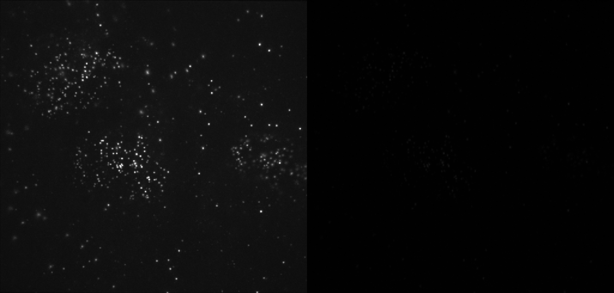
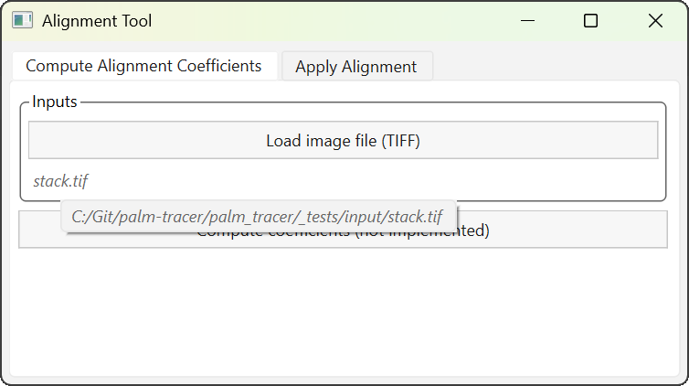
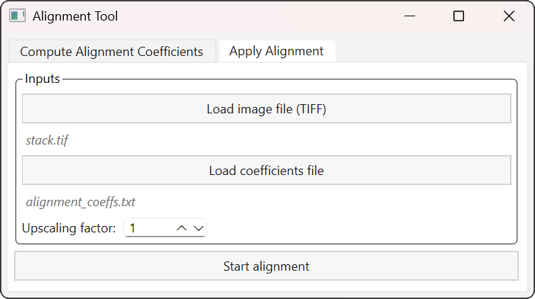

Outil d'alignement
==============================

.. _tool_alignment_page:

.. role:: console(code)
   :language: console

Cette page décrit l'interface et le flux d'utilisation actuels. Certaines fonctionnalités (calcul automatique des coefficients) sont en cours d'implémentation.

Lancement
---------

1. Ouvrez un terminal ou une invite de commande (:console:`PowerShell` sur Windows) dans le dossier où vous avez extrait les fichiers du projet.
   Exemple pour :file:`C:\\palm-tracer`. Ouvrez le terminal et tapez la commande suivante  :console:`cd C:\\palm_tracer` et appuyez sur **Entrée**
2. Assurez-vous que l'environnement virtuel est activé si vous l'utilisez.
3. Lancez Napari avec la commande : :console:`napari`

.. note:: Si vous n'avez pas créé d'environnement virtuel, Napari peut être lancé depuis n'importe où.

4. lancez l'outil dans Napari : :menuselection:`Plugins --> PALM Tracer --> Alignment Tool`

Organisation de l'interface
----------------------------------

L'outil est organisé en deux onglets correspondant aux deux étapes principales du workflow.

.. list-table::
   :align: center
   :widths: 50 50
   :class: image-grid

   * - .. figure:: ../_static/img/tool_align/tab_1.png
          :figclass: centered-caption
          :alt: Onglet 1 : Calcul des coefficients d'alignement
          :width: 95%
          :target: ../_static/img/tool_align/tab_1.png

          Onglet 1 : Calcul des coefficients d'alignement

     - .. figure:: ../_static/img/tool_align/tab_2.png
          :figclass: centered-caption
          :alt: Onglet 2 : Alignement
          :width: 95%
          :target: ../_static/img/tool_align/tab_2.png

          Onglet 2 : Alignement

Calcul des coefficients (non implémenté actuellement)
----------------------------------------------------------------

.. warning:: Cette fonctionnalité n'est pas encore implémentée dans la version actuelle.

Le calcul des coefficients d'alignement repose sur un fichier TIFF contenant une seule image, composée de deux vues placées côte à côte : vue de référence (gauche), vue déformée (droite).

   Exemple de fichier utilisé pour le calcul des coefficients.

Après chargement, le nom du fichier apparaît sous le bouton correspondant. Un survol du nom avec le curseur de la souris affiche le **chemin complet** du fichier.

   Affichage du chemin complet du fichier.

L'appui sur le bouton :guilabel:`Compute coefficients` permet de lancer le calcul. Celui-ci génère un fichier :file:`alignment_coeffs.csv` dans le dossier du fichier de référence.

Alignement d'une pile
----------------------------------------------------------------

Cette étape permet d'appliquer des coefficients d'alignement à une pile d'images TIFF. Vous devez fournir : un fichier TIFF à aligner, un fichier de coefficients d'alignement.

.. note:: Le format actuellement pris en charge correspond à celui de Metamorph : un fichier texte contenant une ligne d'en-tête suivie de deux lignes de 10 valeurs.

Comme précédemment, le nom du fichier chargé est affiché sous le bouton, et un survol permet d'en visualiser le chemin complet.

   Interface d'alignement d'une pile.

Il est possible d'indiquer un facteur d'agrandissement pour augmenter la précision subpixel de la déformation.

.. important::
   | L'agrandissement modifie la résolution spatiale des données :
   | la taille de pixel est divisée par le facteur d'agrandissement, par exemple, **100 nm/pixel** devient **50 nm/pixel** avec un facteur de 2.
   | Pensez à mettre à jour vos paramètres de calibration pour les traitements ultérieurs.

L'appui sur le bouton :guilabel:`Start Alignment` lance le calcul d'alignement.
Un nouveau fichier TIFF est généré dans le même dossier que le fichier d'origine, avec le suffixe :file:`_aligned`. Exemple : :file:`stack.tif` → :file:`stack_aligned.tif`.

Le fichier original n'est **pas modifié**.
