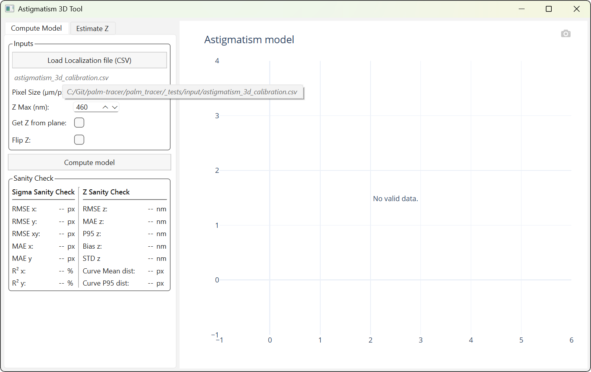
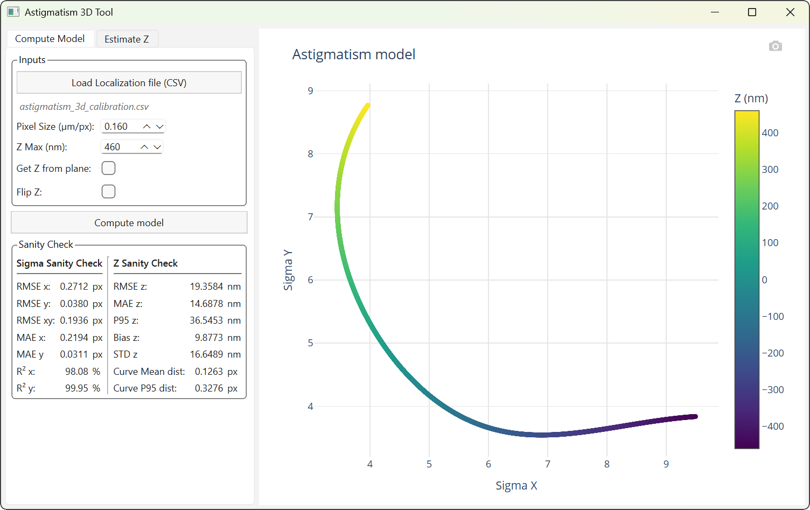
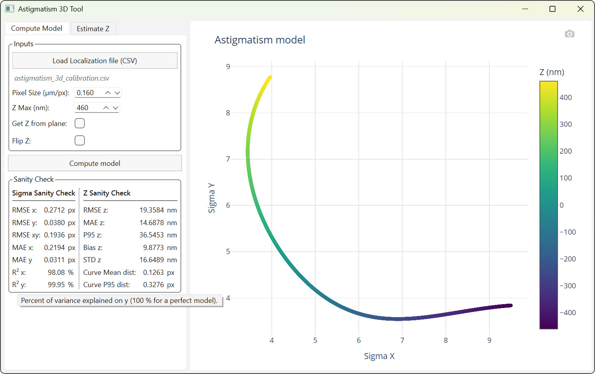
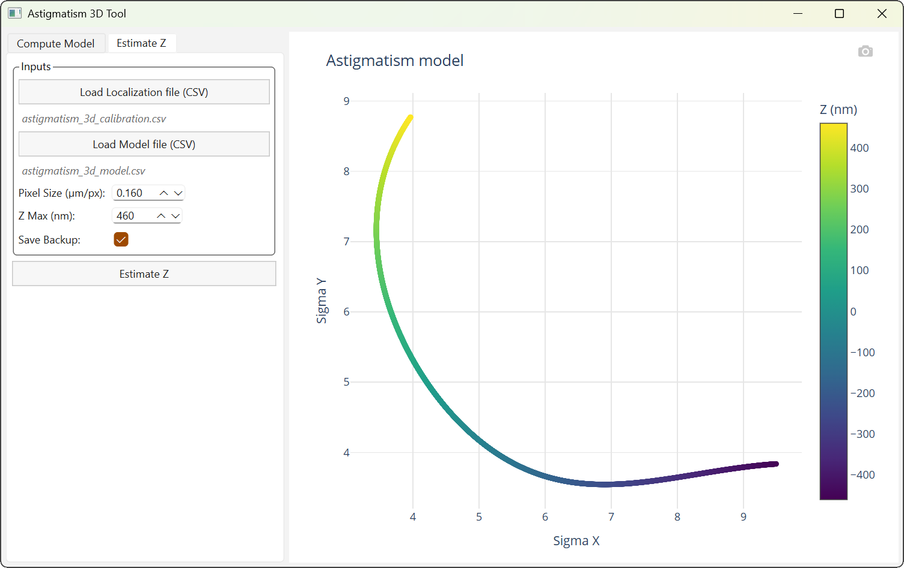

Outil d'astimagtisme 3D
==============================

.. _tool_astig_page:

.. role:: console(code)
   :language: console

Cette page décrit l'outil **Astigmatism 3D**, utilisé pour calibrer un modèle d’astigmatisme axial et estimer la position axiale (Z) à partir des largeurs de PSF (Sigma X / Sigma Y).

Lancement
---------

1. Ouvrez un terminal ou une invite de commande (:console:`PowerShell` sur Windows) dans le dossier où vous avez extrait les fichiers du projet.
   Exemple pour :console:`C:\\palm-tracer`. Ouvrez le terminal et tapez la commande suivante  :console:`cd C:\\palm_tracer` et appuyez sur **Entrée**
2. Assurez-vous que l'environnement virtuel est activé si vous l'utilisez.
3. Lancez Napari avec la commande : :console:`napari`

.. note::
   Si vous n'avez pas créé d'environnement virtuel, Napari peut être lancé depuis n'importe où.

4. lancez l'outil dans Napari : :menuselection:`Plugins --> PALM Tracer --> Astigmatism 3D Tool`

Organisation de l'interface
----------------------------------

L'outil est organisé en deux onglets correspondant aux deux étapes principales du workflow.

L’interface est organisée en deux onglets, correspondant aux deux étapes classiques du workflow astigmatique :
   - Compute Model : calibration du modèle d’astigmatisme à partir de données calibrées
   - Estimate Z : estimation de la position axiale à partir d’un modèle existant.

La partie droite de la fenêtre affiche en permanence une visualisation du modèle astigmatique courant (courbes Sigma X et Sigma Y en fonction de Z).
Vous pouvez appuyer sur l'icone camera (📷) au dessus du graphique pour enregistrer une image png directement.

.. list-table::
   :align: center
   :widths: 50 50
   :class: image-grid

   * - .. figure:: ../_static/img/tool_astig/tab_1.png
          :figclass: centered-caption
          :alt: Onglet 1 : Calcul du modèle.
          :width: 95%
          :target: ../_static/img/tool_astig/tab_1.png

          Onglet 1 : Calcul du modèle.

     - .. figure:: ../_static/img/tool_astig/tab_2.png
          :figclass: centered-caption
          :alt: Onglet 2 : Estimation de la position axiale (Z)
          :width: 95%
          :target: ../_static/img/tool_astig/tab_2.png

          Onglet 2 : Estimation de la position axiale (Z)

Calcul du modèle
----------------

Cet onglet permet de calculer un modèle d’astigmatisme à partir d’un jeu de localisations calibrées en Z.

Après chargement d’un fichier CSV contenant au minimum les colonnes ``Sigma X``, ``Sigma Y`` et ``Z``, les paramètres suivants peuvent être ajustés :
   - la taille de pixel (µm/px),
   - la valeur maximale de Z,
   - la reconstruction éventuelle de Z à partir des plans,
   - l'inversion du signe de Z.

Après chargement, le nom du fichier apparaît sous le bouton correspondant. Un survol du nom avec le curseur de la souris affiche le **chemin complet** du fichier.

   Affichage du chemin complet du fichier.

Si Z n'est pas calibré, les plans sont utilisés (donc une colonne ``PLane`` est nécessaire) pour remplir la colonne Z, il faut activer l'option *Get Z from plane* et indiquer la valeur maximale absolue de Z (Z Max) en nanomètres pour reconstruire Z sur l’intervalle [-Z Max ; +Z Max].

.. important:: L’ordre croissant ou décroissant des plans ne peut être détecté automatiquement. Une inversion de Z peut être nécessaire selon la convention expérimentale.

L'appui sur le bouton :guilabel:`Compute model` permet de lancer le calcul. Celui-ci génère un fichier :console:`astigmatism_3d_model.csv` dans le dossier du fichier de calibration.

Les indicateurs de cohérence (Sanity Check) sont mis à jour automatiquement et le modèle est affiché dans la zone de visualisation.

   Interface de calcul du modèle d'astigmatisme 3D.

La zone Sanity Check fournit des indicateurs simples permettant d’évaluer rapidement la qualité du modèle.

La colonne de gauche regroupe des métriques liées aux largeurs de PSF (RMSE, MAE, R² sur Sigma X et Sigma Y). La colonne de droite concerne la cohérence axiale du modèle (erreurs sur Z, biais, dispersion et distance à la courbe).

Ces valeurs permettent de détecter rapidement un modèle incohérent, une inversion de Z ou un domaine axial mal défini.
Comme pour les noms de fichier, un survol avec le curseur de la souris permet d'avoir une explication sur chaque métrique

.. important:: L’ordre croissant ou décroissant des plans ne peut être détecté automatiquement. Une inversion de Z peut être nécessaire selon la convention expérimentale.

   Affichage des explications des métriques de sanity check.

.. note:: Un fichier de calibration idéal possède un nombre impair de lignes (pour avoir la ligne centrale avec Z=0) réparties linéairement sur l’intervalle [-Z Max ; +Z Max].
   Le pas entre les plans doit être aussi petit que possible pour garantir la fiabilité du modèle.
   Les irrégularités dans la répartition des plans (pas non régulier, intervalle non centré en 0, etc.) ne peuvent pas être automatiquement prises en compte. Il est conseillé dans ces cas particuliers de remplir la colonne Z en amont.

Estimation de la position axiale (Z)
------------------------------------

Cet onglet permet d’estimer la position axiale pour un fichier de localisations donné contenant au moins les colonnes *Sigma X*, *Sigma Y* et *Z*,
à partir d’un modèle d’astigmatisme existant.

Les paramètres de taille de pixel et de domaine axial doivent être cohérents avec ceux utilisés lors de la calibration du modèle.

Si l’option Save Backup est activée, une copie du fichier original est sauvegardée avant la mise à jour de la colonne Z.

Le bouton :guilabel:`Estimate Z` lance l’estimation. Le fichier CSV est alors réécrit au même emplacement, avec la colonne Z mise à jour.

   Interface d'estimation de la position axiale (Z).
