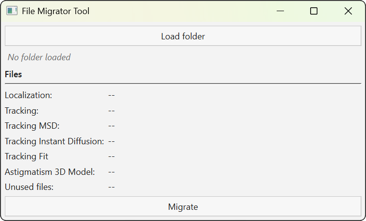
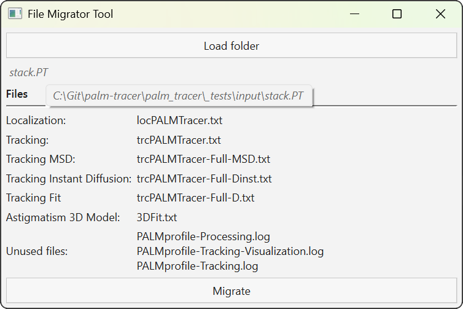

Outil de migration de fichiers
==============================

.. _tool_fm_page:

.. role:: console(code)
   :language: console

Cette page décrit l’utilisation de l’outil **File Migrator**, destiné à convertir des dossiers de résultats PALMTracer issus de MetaMorph
vers le format de fichiers actuel utilisé par PALMTracer dans Napari.

Lancement
---------

1. Ouvrez un terminal ou une invite de commande (:console:`PowerShell` sur Windows) dans le dossier où vous avez extrait les fichiers du projet.
   Exemple pour :console:`C:\\palm-tracer`. Ouvrez le terminal et tapez la commande suivante  :console:`cd C:\\palm_tracer` et appuyez sur **Entrée**
2. Assurez-vous que l'environnement virtuel est activé si vous l'utilisez.
3. Lancez Napari avec la commande : :console:`napari`

.. note::
   Si vous n'avez pas créé d'environnement virtuel, Napari peut être lancé depuis n'importe où.

4. lancez l'outil dans Napari : :menuselection:`Plugins --> PALM Tracer --> File Migrator Tool`

Organisation de l'interface
----------------------------------

L’interface est volontairement simple et se compose : d’un bouton de sélection du dossier à migrer, d’un récapitulatif des fichiers détectés dans ce dossier,
d’un bouton de lancement de la migration. **Aucune modification** n’est effectuée sur le dossier source.

   Interface de l'outil de migration de fichiers.

Utilisation
----------------------------------

Cliquez sur :guilabel:`Load folder` pour sélectionner un dossier de résultats PALMTracer issu de MetaMorph.
Le dossier sélectionné doit correspondre à un dossier .PT généré par MetaMorph.
S’il ne respecte pas strictement cette convention de nommage, un avertissement est affiché, mais l’analyse peut tout de même être effectuée.

Une fois le dossier chargé : son nom est affiché sous le bouton, le contenu du dossier est analysé, les fichiers reconnus sont listés par catégorie.
Un survol du nom avec le curseur de la souris affiche le **chemin complet** du dossier.

   Affichage du chemin complet du fichier.

Cliquez sur :guilabel:`Migrate` pour lancer la conversion des fichiers.
La migration crée un nouveau dossier de sortie, situé au même niveau que le dossier d’origine.

Règle de nommage : ``mon_experience.PT`` → ``mon_experience_PALM_Tracer``. Le dossier source n’est **jamais** modifié.

Fichiers actuellement pris en charge :
   - Fichier de localisations : ``locPALMTracer.txt``
   - Fichier de trajectoires : ``trcPALMTracer.txt``
   - Fichiers de calculs sur les trajectoires : ``trcPALMTracer-Full-D.txt``, ``trcPALMTracer-Full-Dinst.txt``, ``trcPALMTracer-Full-MSD.txt``
   - Fichier de modèle d'astigmatism 3D : ``3DFit.txt``
