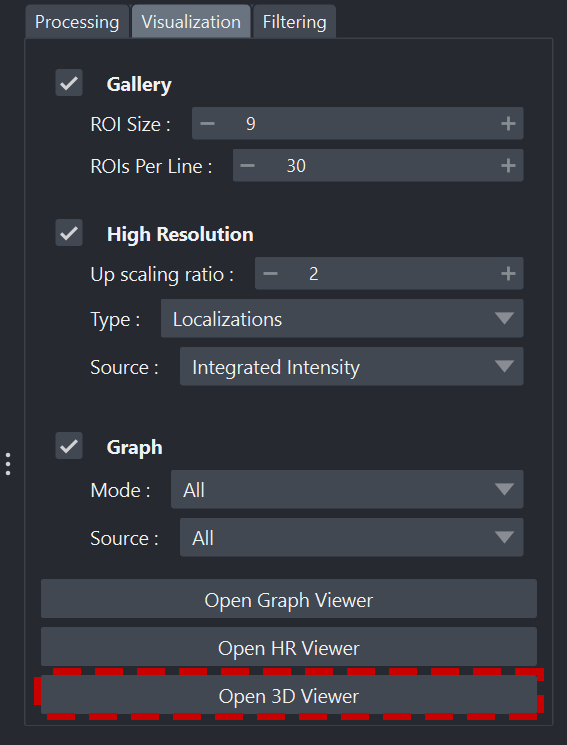
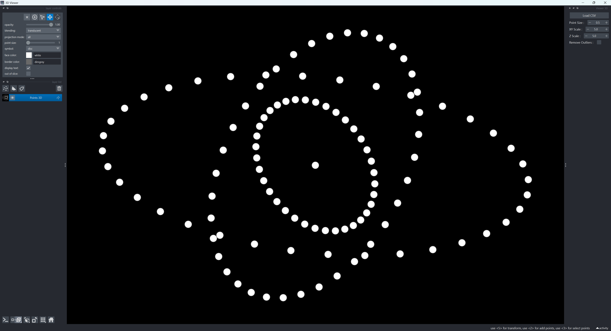
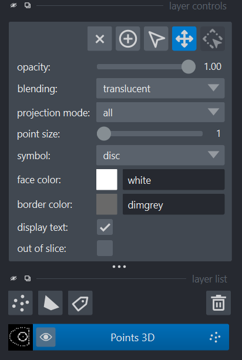
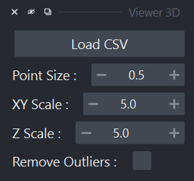
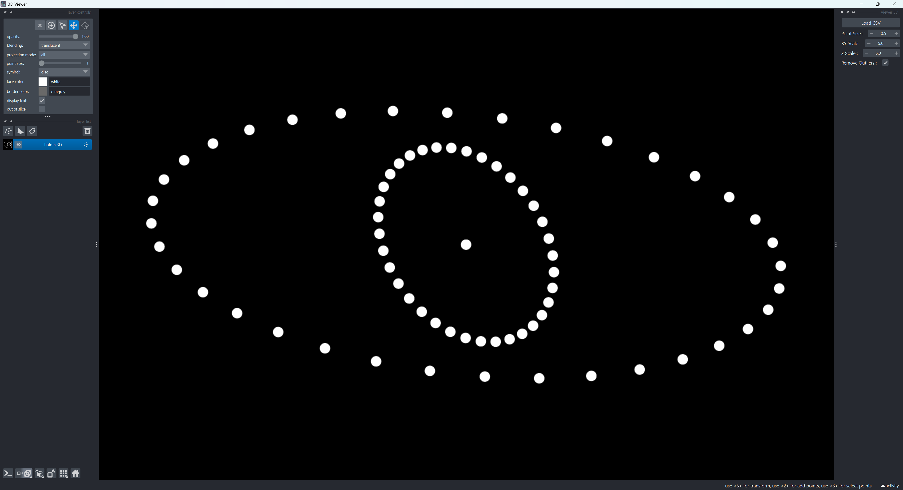

Visionneuse 3D
==============================

.. _viewer_3d_page:

.. role:: python(code)
   :language: python

.. role:: console(code)
   :language: console

Lancement
---------

1. Ouvrez un terminal ou une invite de commande (:console:`PowerShell` sur Windows) dans le dossier où vous avez extrait les fichiers du projet.
   Exemple pour :file:`C:\\palm-tracer`. Ouvrez le terminal et tapez la commande suivante  :console:`cd C:\\palm_tracer` et appuyez sur **Entrée**
2. Assurez-vous que l'environnement virtuel est activé si vous l'utilisez.
3. Lancez Napari avec la commande : :console:`napari`

.. note::
   Si vous n'avez pas créé d'environnement virtuel, Napari peut être lancé depuis n'importe où.

4. Activez le plugin dans Napari : :menuselection:`Plugins --> PALM Tracer --> PALM Tracer`

.. note::
   Il est possible de lancer Napari directement avec le plugin avec la commande : :console:`napari -w palm-tracer`

5. Dans l'onglet :guilabel:`Visualization` de PALM Tracer, vous avez un bouton pour lancer la visionneuse de graphiques :guilabel:`Open 3D Viewer`.
   Il est également possible de l'ouvrir directement à partir du menu Napari : :menuselection:`Plugins --> PALM Tracer --> Viewer 3D`

   Volet calque de Napari

Organisation de l'interface
----------------------------------

   Vue d'ensemble de Napari avec le widget Viewer 3D

L'interface Napari avec la visionneuse 3D est organisée en trois volets principaux :

- À gauche : le panneau des calques (Layers).
- Au centre : la fenêtre de visualisation.
- À droite : le widget de la visionneuse.

Volet Calque
^^^^^^^^^^^^^^^^^^^^^^^^^^^^^^^^^^

   Volet calque de Napari

Le volet des calques est la zone où apparaissent tous les éléments visuels générés par le widget pour Napari :

- Points détectés (en précision flottante et zoomable à l'infini).

Volet de visualisation
^^^^^^^^^^^^^^^^^^^^^^^^^^^^^^^^^^

   Volet de visualisation de Napari

La zone centrale de Napari affiche les données. Vous pouvez :

- Zoomer (molette de la souris)
- Effectuer une rotation (clic gauche maintenu)

Volet Widget
^^^^^^^^^^^^^^^^^^^^^^^^^^^^^^^^^^

   Volet Widget de Napari

Le volet de droite contient le widget principal de la visionneuse.

Le widget est structuré comme suit :

- Bouton :guilabel:`Load CSV`
- Les options de visualisation

Ouverture des fichiers
----------------------------------

Pour mettre à jour ou modifier le fichier utilisé par la visionneuse, il faut cliquer sur le bouton :guilabel:`Load CSV`.
Pour être valide, le fichier doit contenir au moins les colonnes X, Y, Z et Integrated Intensity

Options de visualisation
----------------------------

   Options de visualisation

Les options de visualisation sont assez simples :

- **Point Size** vous permet de définir le diamètre des points pour la représentation vectorielle.
- **XY Scale** et **Z Scale** vous permettent de définir une échelle différente sur le plan XY ou l'axe Z.
  Utile si vous avez des unités différentes comme des pixels pour X et Y et des nanomètres pour Z.
- **Remove Outliers** vous permet de cacher les points dont l'intensité intégrée est à 0.
  Ce marqueur peut être utilisé en cas d'erreur lors de l'ajustement gaussien.
  Par exemple, le point n'est pas supprimé, mais son intensité à 0 permet de le mettre à part facilement lors de la lecture du fichier pour des analyses ultérieures.

   Suppression des outliers

Messages de l'application
----------------------------

Des messages peuvent apparaitre à tout moment dans la console et dans les notifications Napari.

   Notification Napari

.. code-block:: console

   WARNING: Le fichier doit contenir les colonnes X, Y, Z et Integrated Intensity.

Ce message indique que le fichier sélectionné ne contient pas les 4 colonnes essentielles à la visualisation.
