Visionneuse de graphique
==============================

.. _viewer_graph_page:

.. role:: python(code)
   :language: python

.. role:: console(code)
   :language: console

Lancement
---------

1. Ouvrez un terminal ou une invite de commande (:console:`PowerShell` sur Windows) dans le dossier où vous avez extrait les fichiers du projet.
   Exemple pour :file:`C:\\palm-tracer`. Ouvrez le terminal et tapez la commande suivante  :console:`cd C:\\palm_tracer` et appuyez sur **Entrée**
2. Assurez-vous que l'environnement virtuel est activé si vous l'utilisez.
3. Lancez Napari avec la commande : :console:`napari`

.. note:: Si vous n'avez pas créé d'environnement virtuel, Napari peut être lancé depuis n'importe où.

4. Activez le plugin dans Napari : :menuselection:`Plugins --> PALM Tracer --> PALM Tracer`

.. note:: Il est possible de lancer Napari directement avec le plugin avec la commande : :console:`napari -w palm-tracer`

5. Dans l'onglet :guilabel:`Visualization` de PALM Tracer, vous avez un bouton pour lancer la visionneuse de graphiques :guilabel:`Open graph Viewer`

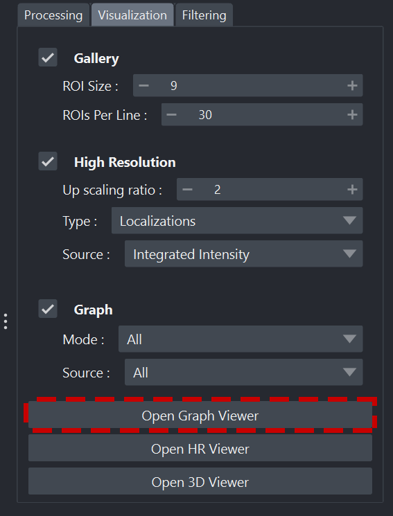

   Lancement de la visionneuse

Organisation de l'interface
----------------------------------

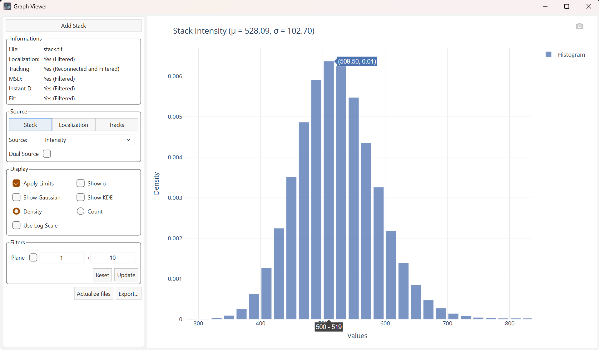

   Vue d'ensemble de la visionneuse de graphiques

L'interface de la visionneuse de graphiques est organisée en 2 volets principaux :

- À gauche : le panneau des options permettant de paramétrer les graphiques
- À droite : le graphique généré

Volet paramètres
^^^^^^^^^^^^^^^^^^^^^^^^^^^^^^^^^^

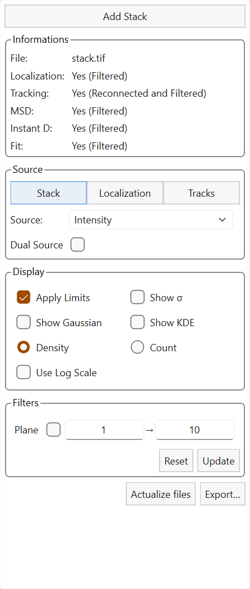

   Volet Paramètres.

Le volet de gauche contient les paramètres principaux de manipulation des graphiques.

Le widget est structuré comme suit :

- Onglet Informations
- Onglet Source
- Onglet Affichage
- Onglet Filtres
- Boutons :guilabel:`Actualize Files` et :guilabel:`Export…`.

Volet de visualisation
^^^^^^^^^^^^^^^^^^^^^^^^^^^^^^^^^^

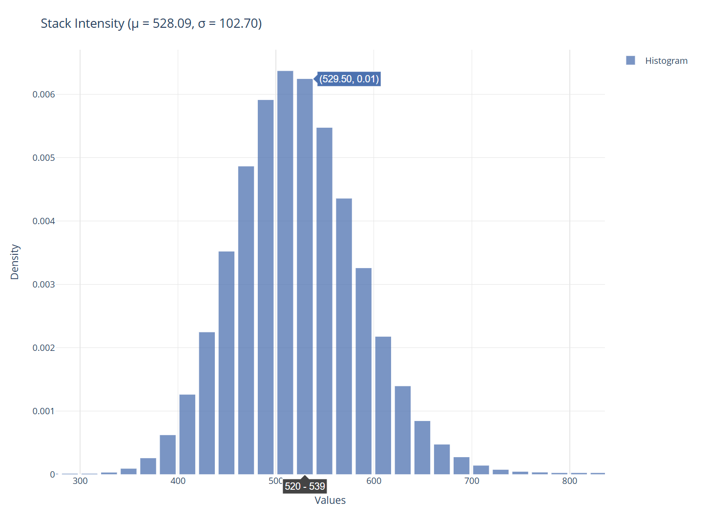

   Volet de visualisation.

Le volet de droite affiche les graphiques générés. Vous pouvez survoler le graphique pour avoir les valeurs associées au graphique.

Ajout d'une pile
----------------------------------

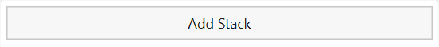

La visionneuse est initialement faite pour être lancée et utilisée à partir de l'interface principale de PALMTracer sur Napari.
Il est possible d'ajouter un fichier tif à partir de la visionneuse.
Celle-ci sera automatiquement ajoutée au Batch de l'interface principale et les derniers éléments calculés pour ce nouveau fichier seront chargés.

.. note:: La visionneuse peut également être lancée indépendamment de l'interface principale, l'ajout d'une pile et le chargement des résultats ne se feront que par ce bouton.

Onglet informations
----------------------------------

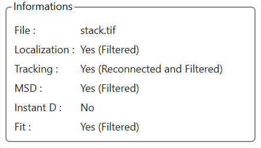

   Onglet Informations

Cet onglet contient le nom du fichier courant ainsi qu'un statut pour les différentes catégories de données (Localisation, Trajectoires, MSD, Diffusion instantanée, Fit).

Le statut est défini comme suit:

- **No** : Une absence de données.
- **Yes** : Un tableau standard.
- **Yes (Filtered)** : Un tableau filtré.
- **Yes (Reconnected)** : Un tableau de trajectoire ayant subi des reconnexions dues au scintillement.
- **Yes (Reconnected and Filtered)** : Un tableau de trajectoire ayant subi des reconnexions dues au scintillement et filtré.

Onglet source
----------------------------------

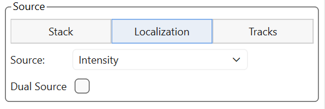

   Onglet Source

Il existe 3 types de données à visualiser qui sont les informations relatives à la pile (*stack*) chargée, les localisations et les trajectoires.

.. note::
   La liste déroulante des sources s'adapte dynamiquement selon les sources disponibles, notamment pour les trajectoires dont les données disponibles varient selon l'ajustement.

.. list-table::
   :align: center
   :widths: 30 30 30
   :class: image-grid

   * - .. figure:: ../_static/img/viewer_graph/loc_src.png
          :figclass: centered-caption
          :alt: Affichage des sources disponibles pour les localisations
          :width: 95%
          :target: ../_static/img/viewer_graph/loc_src.png

          Sources pour les localisations

     - .. figure:: ../_static/img/viewer_graph/trc_src.png
          :figclass: centered-caption
          :alt: Affichage des sources disponibles pour les trajectoires
          :width: 95%
          :target: ../_static/img/viewer_graph/trc_src.png

          Sources pour les trajectoires

     - .. figure:: ../_static/img/viewer_graph/trc_src2.png
          :figclass: centered-caption
          :alt: Affichage des sources disponibles pour les trajectoires sans les ajustements
          :width: 95%
          :target: ../_static/img/viewer_graph/trc_src2.png

          Sources pour les trajectoires sans les ajustements

Onglet affichage
----------------------------------

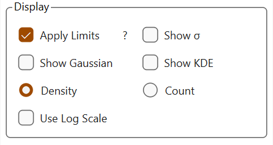

   Onglet Affichage

Cet onglet permet de définir quelques options d'affichage sans modifier les données :

- **Apply limits** permet de limiter l'intervalle d'affichage sur l'axe X en fonction de la règle des 3 sigmas
  (on n'affiche que les éléments situés à plus ou moins 3 sigmas de la moyenne).

.. list-table::
   :align: center
   :widths: 50 50
   :class: image-grid

   * - .. figure:: ../_static/img/viewer_graph/count.png
          :figclass: centered-caption
          :alt: Affichage des sources disponibles pour les localisations
          :width: 95%
          :target: ../_static/img/viewer_graph/count.png

          Affichage simple

     - .. figure:: ../_static/img/viewer_graph/limits.png
          :figclass: centered-caption
          :alt: Affichage des sources disponibles pour les trajectoires
          :width: 95%
          :target: ../_static/img/viewer_graph/limits.png

          Affichage avec les limites

- **Show Sigma** permet d'ajouter au graphique l'affichage de barres pour la moyenne (trait plein), moyenne plus ou moins 1, 2 et 3 sigmas (pointillé).

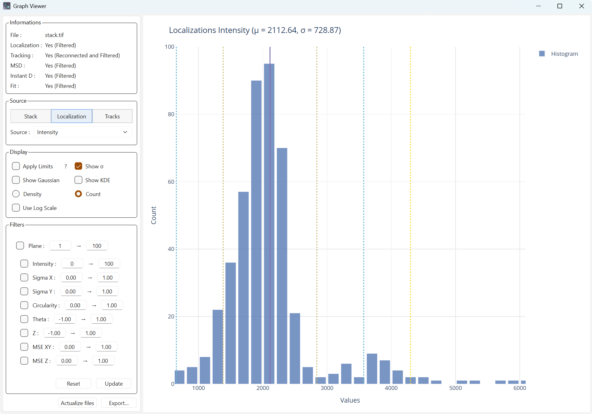

   Affichage avec les moyennes et écart-type

- **Show Gaussian** permet d'ajouter la gaussienne associée à la moyenne et l'écart-type calculés sur les données.

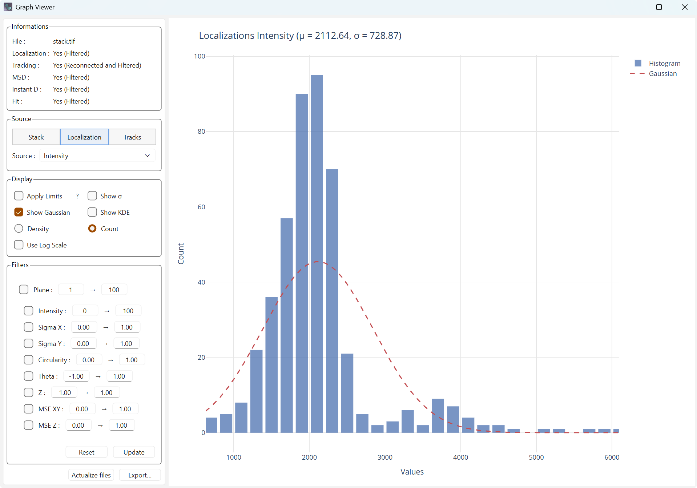

   Affichage avec la gaussienne

- **Show KDE** permet d'ajouter le noyau de densité (Kernel Density) des données qui est l'estimation de la densité en tout point.

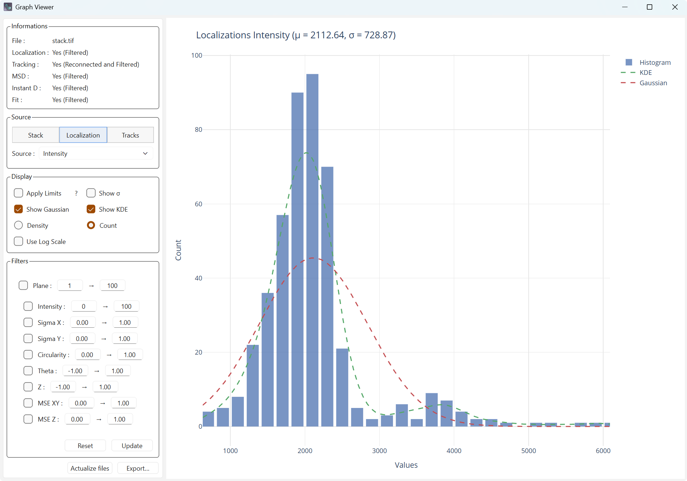

   Affichage avec le noyau de densité

- **Density** et **Count** permettent de définir la valeur sur l'axe Y.

.. list-table::
   :align: center
   :widths: 50 50
   :class: image-grid

   * - .. figure:: ../_static/img/viewer_graph/density.png
          :figclass: centered-caption
          :alt: Affichage de la densité
          :width: 95%
          :target: ../_static/img/viewer_graph/density.png

          Affichage de la densité

     - .. figure:: ../_static/img/viewer_graph/count.png
          :figclass: centered-caption
          :alt: Affichage du compteur
          :width: 95%
          :target: ../_static/img/viewer_graph/count.png

          Affichage du compteur

- **Use Log Scale** permet de modifier l'échelle de l'axe X avec une échelle logarithmique ce qui peut rendre la distribution plus proche d'une loi normale.

.. list-table::
   :align: center
   :widths: 50 50
   :class: image-grid

   * - .. figure:: ../_static/img/viewer_graph/kde.png
          :figclass: centered-caption
          :alt: Affichage de la densité
          :width: 95%
          :target: ../_static/img/viewer_graph/kde.png

          Échelle standard

     - .. figure:: ../_static/img/viewer_graph/log.png
          :figclass: centered-caption
          :alt: Affichage du compteur
          :width: 95%
          :target: ../_static/img/viewer_graph/log.png

          Échelle logarithmique

Le Dual Source
^^^^^^^^^^^^^^^^^^^^^^^^^^^^^^^^^^^^

Le Dual Source permet de faire un graphique avec deux sources différentes. L'affichage des courbes associées aux distributions (gaussiennes ou noyau de densité) sera alors une Heatmap. Le noyau de densité (KDE) est alors une estimation de la densité en fonction des deux sources, ce qui, visuellement, peut-être plus explicite.

.. list-table::
   :align: center
   :widths: 50 50
   :class: image-grid

   * - .. figure:: ../_static/img/viewer_graph/dual.png
          :figclass: centered-caption
          :alt: Affichage du Sigma en X et en Y.
          :width: 95%
          :target: ../_static/img/viewer_graph/dual.png

          Affichage du Sigma en X et en Y.

     - .. figure:: ../_static/img/viewer_graph/dual_kde.png
          :figclass: centered-caption
          :alt: Affichage du compteur
          :width: 95%
          :target: ../_static/img/viewer_graph/dual_kde.png

          Affichage de la Heatmap du noyau de densité.

Onglet filtres
----------------------------------

Selon le type de données, la liste des filtres est mise à jour pour ne conserver que ceux concernant les données en cours d'affichage.

.. list-table::
   :align: center
   :widths: 30 30 30
   :class: image-grid

   * - .. figure:: ../_static/img/viewer_graph/filters.png
          :figclass: centered-caption
          :alt: Filtres pour la pile
          :width: 95%
          :target: ../_static/img/viewer_graph/filters.png

          Filtres pour la pile

     - .. figure:: ../_static/img/viewer_graph/filters_loc.png
          :figclass: centered-caption
          :alt: Filtres pour les localisations
          :width: 95%
          :target: ../_static/img/viewer_graph/filters_loc.png

          Filtres pour les localisations

     - .. figure:: ../_static/img/viewer_graph/filters_trc.png
          :figclass: centered-caption
          :alt: Filtres pour les trajectoires
          :width: 95%
          :target: ../_static/img/viewer_graph/filters_trc.png

          Filtres pour les trajectoires

Chaque filtre doit-être coché pour être effectif, mais ne sera pas appliqué tant qu'il n'y aura pas d'appuie sur le bouton :guilabel:`Update`.
À ce moment, les filtres seront appliqués au sein de l'interface principale sur les dernières données en mémoire (données de base ou déjà filtré),
les options de filtrage seront mises à jour également dans l'interface principale.

L'appui sur le bouton :guilabel:`Reset`, supprimera les données filtrées de la mémoire, le panneau d'information affichera cette mise à jour dans les statuts des fichiers.
Les filtres ne seront pas effacés, pour que vous conserviez l'ensemble de vos paramètres et faire les petits ajustements nécessaires avant de relancer un filtrage.
Le graphique actuel sera recalculé après la réinitialisation.

.. list-table::
   :align: center
   :widths: 50 50
   :class: image-grid

   * - .. figure:: ../_static/img/viewer_graph/filtered.png
          :figclass: centered-caption
          :alt: Affichage avec filtres
          :width: 95%
          :target: ../_static/img/viewer_graph/filtered.png

          Affichage avec filtres

     - .. figure:: ../_static/img/viewer_graph/reset_filtered.png
          :figclass: centered-caption
          :alt: Affichage avec filtres réinitialisés
          :width: 95%
          :target: ../_static/img/viewer_graph/reset_filtered.png

          Affichage avec filtres réinitialisés

.. note::
   Si vous avez supprimé des localisations par le biais de filtres, les trajectoires ne sont pas recalculées.
   Certaines trajectoires peuvent alors contenir des points filtrés, un nouveau process avec les filtres actifs doit être lancé dans l'interface principale.

Lien avec l'interface principale
----------------------------------

Cette visionneuse est fortement liée à l'interface principale de PALMTracer et ne peut fonctionner à part.
Il utilise les éléments calculés dans l'interface principale de façon dynamique.

Les éléments suivants sont utilisés :

- Les localisations (filtrées ou non)
- Les trajectoires (reconnectées si elles l'ont été et filtré ou non)
- Les calculs sur trajectoires : MSD, Diffusion instantanée, Ajustements (filtrés ou non)

Plusieurs éléments permettent une communication bidirectionnelle entre les deux interfaces :

- :guilabel:`Actualize files`, situé au plus bas, vous permet de mettre à jour les différents tableaux si un nouveau calcul a été effectué dans l'interface principale.
- :guilabel:`Reset` permets de supprimer les tableaux filtrés pour repartir sur une base saine.
- :guilabel:`Update` permets d'appliquer votre nouvelle sélection de filtres sur les tableaux (filtrés s'ils existent sinon sur les tableaux initiaux).

Export
----------------------------------

Lors d'un appui sur :guilabel:`Export…`, vous aurez le choix entre plusieurs formats de fichiers pour sauvegarder le graphique que vous avez actuellement :

- **HTML** enregistre une page web interactive (incluant PlotlyJS) comme sur la visionneuse.
- **PNG** exporte une image du rendu du graphique.
- **PDF** exporte l'image dans un fichier PDF

Vous pouvez également appuyer sur l'icône caméra (📷) au-dessus du graphique pour enregistrer une image PNG directement.
