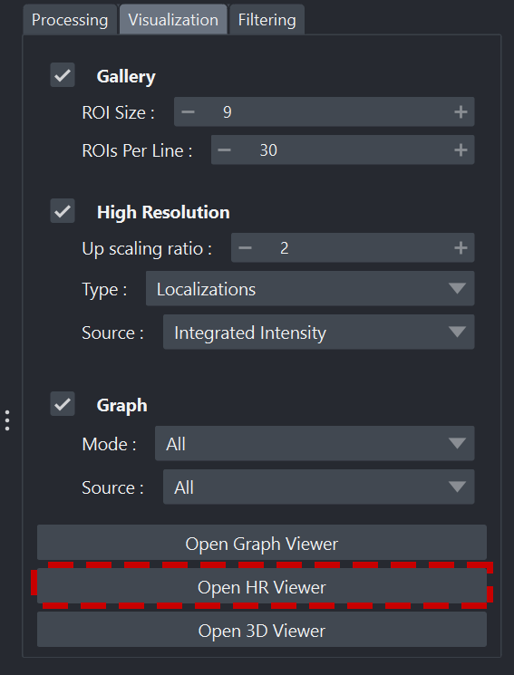
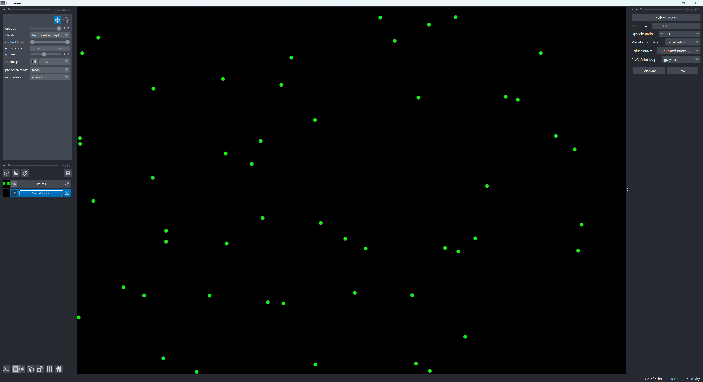
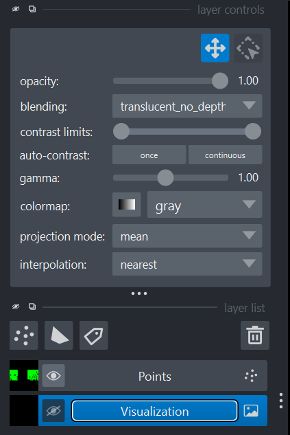
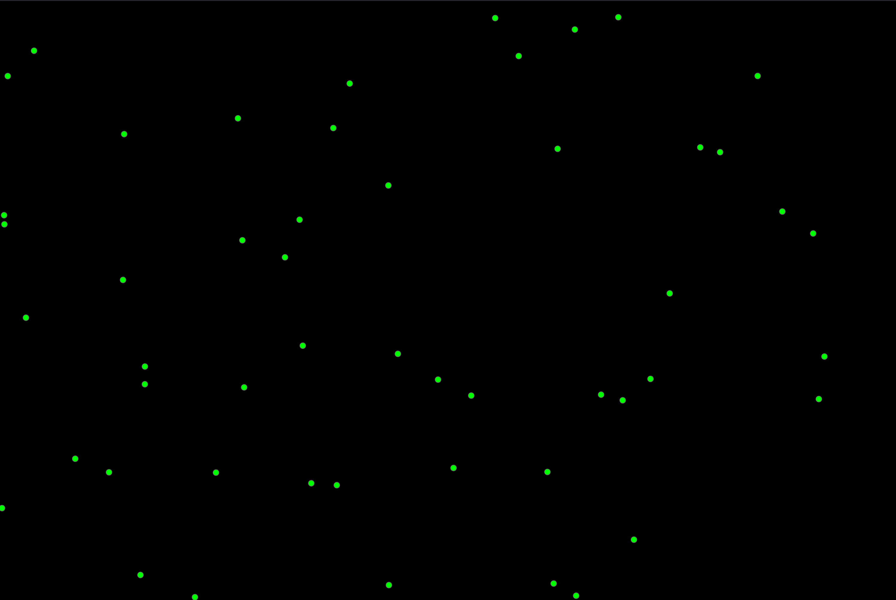
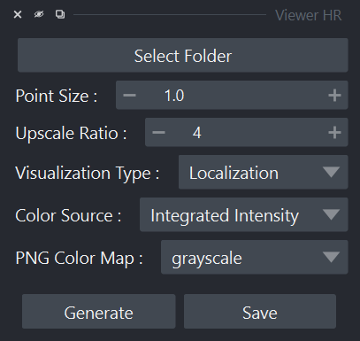
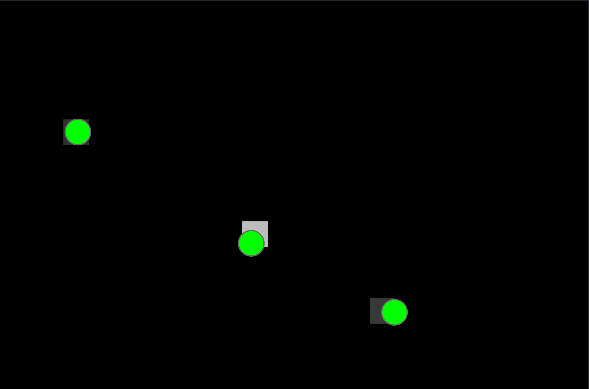
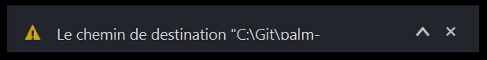

Visionneuse haute résolution
==============================

.. _viewer_hr_page:

.. role:: python(code)
   :language: python

.. role:: console(code)
   :language: console

Lancement
---------

1. Ouvrez un terminal ou une invite de commande (:console:`PowerShell` sur Windows) dans le dossier où vous avez extrait les fichiers du projet.
   Exemple pour :file:`C:\\palm-tracer`. Ouvrez le terminal et tapez la commande suivante  :console:`cd C:\\palm_tracer` et appuyez sur **Entrée**
2. Assurez-vous que l'environnement virtuel est activé si vous l'utilisez.
3. Lancez Napari avec la commande : :console:`napari`

.. note::
   Si vous n'avez pas créé d'environnement virtuel, Napari peut être lancé depuis n'importe où.

4. Activez le plugin dans Napari : :menuselection:`Plugins --> PALM Tracer --> PALM Tracer`

.. note::
   Il est possible de lancer Napari directement avec le plugin avec la commande : :console:`napari -w palm-tracer`

5. Dans l'onglet :guilabel:`Visualization` de PALM Tracer, vous avez un bouton pour lancer la visionneuse de graphiques :guilabel:`Open HR Viewer`.
   Il est également possible de l'ouvrir directement à partir du menu Napari : :menuselection:`Plugins --> PALM Tracer --> Viewer HR`

   Lancement de la visionneuse

Organisation de l'interface
----------------------------------

   Vue d'ensemble de Napari avec le widget Viewer HR

L'interface Napari avec la visionneuse haute résolution est organisée en trois volets principaux :

- À gauche : le panneau des calques (Layers).
- Au centre : la fenêtre de visualisation.
- À droite : le widget de la visionneuse.

Volet Calque
^^^^^^^^^^^^^^^^^^^^^^^^^^^^^^^^^^

   Volet calque de Napari

Le volet des calques est la zone où apparaissent tous les éléments visuels générés par le widget pour Napari :

- Image haute résolution générée
- Points ou trajectoires détectées (en précision flottante et zoomable à l'infini)

Fonctionnalités principales :

- Afficher / masquer un calque.
- Modifier la transparence.
- Changer la colormap.
- Réorganiser l'ordre des calques.

Volet de visualisation
^^^^^^^^^^^^^^^^^^^^^^^^^^^^^^^^^^

   Volet de visualisation de Napari

La zone centrale de Napari affiche les données. Vous pouvez :

- Zoomer (molette de la souris).
- Vous déplacer (clic gauche maintenu).
- Changer de plan Z via la barre de dimension (pour le cas des trajectoires).
- Régler le contraste.

Cette zone se met automatiquement à jour cette zone à chaque appui sur le bouton :guilabel:`Generate`.

Volet Widget
^^^^^^^^^^^^^^^^^^^^^^^^^^^^^^^^^^

   Volet Widget de Napari

Le volet de droite contient le widget principal de la visionneuse.

Le widget est structuré comme suit :

- Bouton :guilabel:`Select Folder`.
- Les options de visualisation.
- Boutons :guilabel:`Generate` et :guilabel:`Save`.

Ouverture des fichiers
----------------------------------

Pour mettre à jour ou modifier les fichiers utilisés par la visionneuse, il faut cliquer sur le bouton :guilabel:`Select Folder`.

Pour un dossier sélectionné, il va sélectionner le dernier fichier de paramètres de calcul disponible et les résultats associés.
Cela signifie que si plusieurs calculs ont été lancés sur le même fichier, seul le dernier sera pris en compte.
Donc, si des trajectoires ont été calculées précédemment, mais pas durant le dernier calcul, il ne prendra pas les résultats de l'essai précédent.
Le but est d'éviter d'avoir un mélange de résultats avec des paramètres potentiellement différents.

Vous aurez dans la console un bloc de message comme ceci :

.. code-block:: console

   Loading files from the 'YOUR_PATH' folder with the timestamp 20251216_163843.
   File 'localizations' loaded successfully.
   File 'localizations_filtered' loaded successfully.
   File 'tracking' loaded successfully.
   File 'tracking_filtered' loaded successfully.
   File 'tracking-reconnected' loaded successfully.
   File 'tracking_filtered_reconnected' loaded successfully.
   File 'tracking_MSD' loaded successfully.
   File 'tracking_MSD' loaded successfully.
   File 'tracking_InstantD' loaded successfully.
   File 'tracking_InstantD_filtered' loaded successfully.
   Error loading file 'tracking_Fit' : [Errno 2] No such file or directory: 'C:\\Git\\palm-tracer\\palm_tracer\\_tests\\input/stack_PALM_Tracer/tracking_Fit-20251216_163843.csv'
   Error loading file 'tracking_Fit_filtered' : [Errno 2] No such file or directory: 'C:\\Git\\palm-tracer\\palm_tracer\\_tests\\input/stack_PALM_Tracer/tracking_Fit_filtered-20251216_163843.csv'
   Stack loaded successfully.(size: (10, 128, 256)).

Il vous donne un état des lieux du chargement des fichiers et vous pouvez ainsi voir les éléments qui n'ont pas été calculés lors de cet horodatage.
Ici à 16h 38min 43s le 16 décembre 2025, touts les éléments ont été calculés et filtrés excepté le fit sur les trajectoires (il indique qu'il n'a pas trouvé le fichier correspondant).

Options de visualisation
----------------------------

   Options de visualisation

Les options de visualisation sont assez simples :

- **Point Size** vous permet de définir le diamètre des points pour la représentation vectorielle.
  Cela ne change pas la taille du pixel pour la localisation qui sera toujours un carré de 1 pixel.

   Points vectoriels VS Visualisation

- **Upscale Ratio** vous permet de définir le facteur d'agrandissement de la visualisation finale par rapport à la taille de l'acquisition.
- **Visualization Type** vous permet de définir si la visualisation représente des localisations ou des trajectoires.
- **Color Source** vous permet de définir quel élément de la localisation/trajectoire servira à définir l'intensité lumineuse du point.
  Par exemple, l'intensité totale de la molécule détectée ou la valeur de l'incertitude quant à sa position précise (MSE).
- **PNG Color Map** vous permet de définir une color map pour l'image finale qui est générée.
  Par défaut sur Niveau de gris pour les localisations et la carte Viridis pour les trajectoires. Le choix est limité à des cartes **perceptuellement uniformes** ('viridis', 'magma', 'plasma', 'inferno', 'cividis', 'turbo').
  (plus de détail sur les Color Map `ici <https://matplotlib.org/stable/tutorials/colors/colormaps.html>`_)

.. list-table::
   :align: center
   :widths: 50 50
   :class: image-grid

   * - .. figure:: ../_static/img/viewer_hr/loc.png
          :figclass: centered-caption
          :alt: Affichage vectoriel des localisations
          :width: 95%
          :target: ../_static/img/viewer_hr/loc.png

          Affichage vectoriel des localisations

     - .. figure:: ../_static/img/viewer_hr/loc_viz.png
          :figclass: centered-caption
          :alt: Affichage des localisations
          :width: 95%
          :target: ../_static/img/viewer_hr/loc_viz.png

          Affichage des localisations

   * - .. figure:: ../_static/img/viewer_hr/track.png
          :figclass: centered-caption
          :alt: Affichage vectoriel des trajectoires
          :width: 95%
          :target: ../_static/img/viewer_hr/track.png

          Affichage vectoriel des trajectoires

     - .. figure:: ../_static/img/viewer_hr/track_viz.png
          :figclass: centered-caption
          :alt: Affichage des trajectoires
          :width: 95%
          :target: ../_static/img/viewer_hr/track_viz.png

          Affichage des trajectoires

Génération et sauvegarde
----------------------------

Les deux derniers boutons servent à générer la visualisation et les calques associés puis à sauvegarder si l'agrandissement actuel vous satisfait.

Messages de l'application
----------------------------

Des messages peuvent apparaitre à tout moment dans la console et dans les notifications Napari.

   Notification Napari

.. code-block:: console

   WARNING: Le chemin de destination "VOTRE_CHEMIN" n'est pas valide.

Ce message indique que le dossier sélectionné n'existe pas (une erreur lors de la saisie est la raison la plus courante).
Ce message peut apparaitre à l'ouverture, car il essaye d'ouvrir le chemin courant par défaut.
Lorsque vous lancez la visionneuse depuis le Plugin PALMTracer, par défaut, il sélectionnera le dossier de l'image courante et lancera une génération.
Il peut également apparaitre lors d'un appui sur :guilabel:`Generate`.

.. code-block:: console

   WARNING: Aucune Pile de chargée.

Ce message indique que le dossier sélectionné contenant les résultats est bon, mais que la pile n'est pas à l'emplacement prévu par la nomenclature standard de PALMTracer.
Cela arrive si vous avez uniquement récupéré le dossier de résultat ou déplacé celui-ci.
Il a besoin de la pile initiale actuellement pour pouvoir retrouver les dimensions initiales du fichier.
*Cet élément sera potentiellement modifié pour lire, le fichier méta contenant ces informations le cas échéant.*

.. code-block:: console

   WARNING: Aucun fichier de localisation disponible.

Ce message indique que dans le dossier sélectionné et pour le dernier fichier de paramètres, aucune localisation n'a été trouvée.
Il peut apparaitre lors d'un appui sur :guilabel:`Generate`.

.. code-block:: console

   WARNING: Aucun fichier de trajectoires disponible.

Ce message indique que dans le dossier sélectionné et pour le dernier fichier de paramètres, aucune trajectoire n'a été trouvée.
Il peut apparaitre lors d'un appui sur :guilabel:`Generate`.

.. code-block:: console

   INFO: Sauvegarde du fichier image.

Ce message indique que le fichier résultat de la visualisation a été enregistré.
Il peut apparaitre lors d'un appui sur :guilabel:`Save` (si la génération d'une visualisation a été réussie précédemment).
